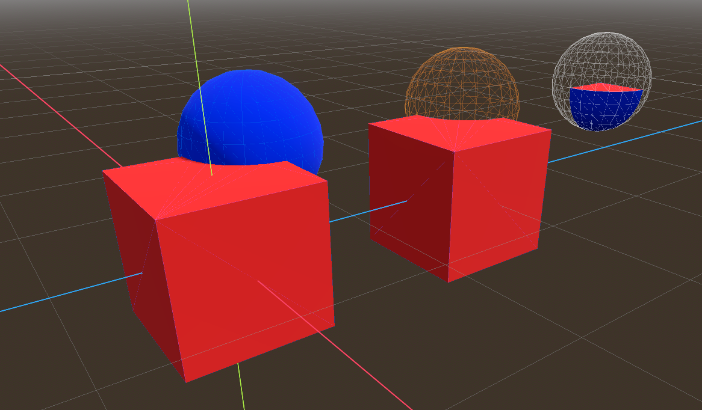

# Constructive Solid Geometry

## Exercice 1

Create the 3 shapes which are combined from red cube and blue sphere

## Exercice 2

Create this complex shapes which are combined from a 
- red cube 
- blue sphere
- 3 green cylinders

## Local host

CSG
[CSG](localhost:5500/docs/csg/index.html)

[link](http://127.0.0.1:5500/docs/csg/index.html)

Web
[Instantiation](localhost:5500/docs/web/index.html)

[link](http://127.0.0.1:5500/docs/web/index.html)

