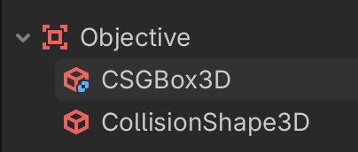

# Introduction

This is the beginning of a tutorial

- apple
- banana

## Markdown

Headings: Use # for H1, ## for H2, etc., up to six levels.

### Bold
Surround text with two asterisks (**bold**) or underscores (__bold__).

### Italics
Surround text with one asterisk (*italic*) or underscore (_italic_).

### Lists
Use *, -, or + for unordered lists, and 1. for ordered lists.

- apple
- banana

1. apple
1. banana

```
def function(x):
    print(123)
```

## Links

[EPFL](http://www.epfl.ch)

## Images




