# Create 3D meshes

A polygon mesh is a collection of vertices, edges and faces that define the surface of a polyhedral object.

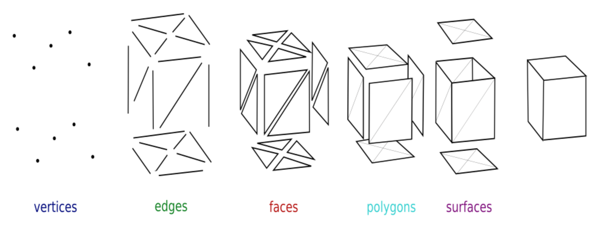

The above image shows these basic concepts: 
- a **vertex** is a point in 3D space (`Vector3`)
- an **edge** is a connection between two vertices
- a **face** is a closed set of edges, such as a triangle or a quad (quadrilateral)
- a **polygon** is a flat (coplanar) set of faces
- a **surface** is a grouping of connected polygons

## Create a simple ArrayMesh

The `ArrayMesh` is a simple type of mesh which can be created via a script.

- in the file browser create a folder called `addons`
- in this folder create a new script file called `triangle.gd`
- add the following parts of code to it

The `@tool` directive allows to execute the script in the editor and therefore to visualize the triangle.
This script extends the class `MeshInstance3D` and creates a new child class called `Triangle`.

```
@tool
extends MeshInstance3D
class_name Triangle
```

The `_ready()` function is executed when the `Triangle` node is added to the tree, for example via the `cmd+A` shortcut. The script creates a new `SurfaceTool` and a new `ArrayMesh`. It selects the primitive triangle method.

```
func _ready():
	var surface_tool = SurfaceTool.new()
	var array_mesh = ArrayMesh.new()
	surface_tool.begin(Mesh.PRIMITIVE_TRIANGLES)
```

Then we then define 3 vertices (`v0, v1, v2`).
With these vertices we define one triangle, in clockwise order.

```
	# Define vertices
	var v0 = Vector3(0, 0, 0)
	var v1 = Vector3(1, 0, 0)
	var v2 = Vector3(0, 0, 1)

	# Define triangles (clockwise order)
	var triangles = [
		[v0, v1, v2]
	]
```

The `SurfaceTool` adds these triangles, creates the normals and commits the mesh.

```
	for tri in triangles:
		for v in tri: surface_tool.add_vertex(v)

	surface_tool.generate_normals() #
	self.mesh = surface_tool.commit() #
```

Now the script is finished and we can access this newly created classe via the menu `Add child node` or short-cut `cmd+A`.
This primitive `Triangle` node appears as a child of `MeshInstance3D`

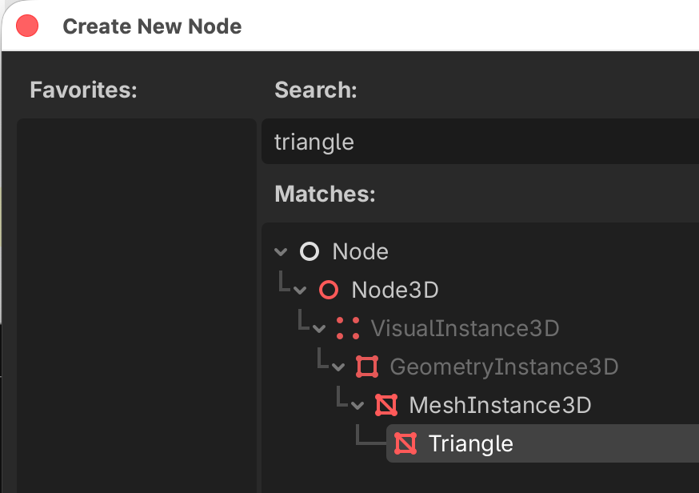{w=500px}

This creates a triangle along the x-axis (red) and z-axis (blue).
The triangle is only visible from the top. Try to see it from the bottom and notice it beeing transparent.

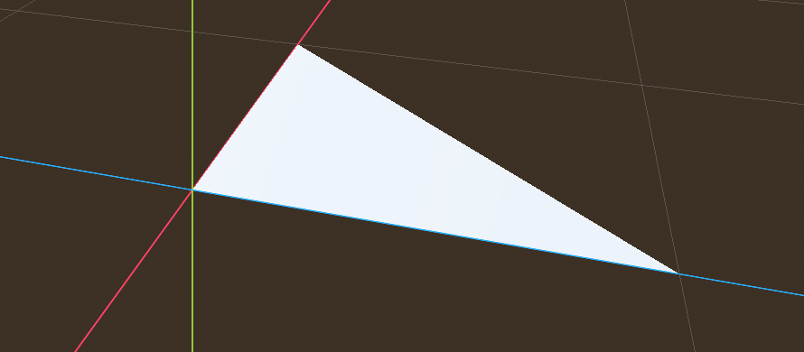

This triangle appears in the inspector with the icon of the `ArrayMesh`.

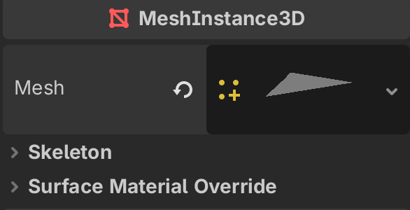{w=300px}


## Create a quad MeshArray

We can add one more vertex and combine two triangles to a quadrilateral.

- add a new file `quad.gd` in the `addons` folder
- add the following script.

```{literalinclude} mesh/addons/quad.gd
:language: gd
:linenos:
```

This script creates 3 vertices (`v0, v1, v2, v3`) and defines a quadrilateral (quad) surface.

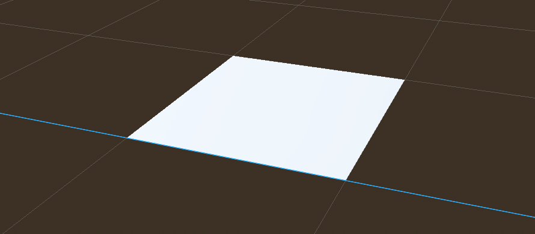

## Create a pyramid MeshArray

We can add one more vertex on top if the quadrilateral.
This allows to create 4 more triangular side surfaces, also defined in clock-wise direction.

- add a new file `pyramid.gd` in the `addons` folder
- add the following script.

```{literalinclude} mesh/addons/pyramid.gd
:language: gd
:linenos:
```

This script creates 5 vertices (`v0, v1, v2, v3, v4`) and 6 triangles which defines a pyramid. 
Notice that we have to invert the ordre of the 2 trinagles forming the base quad, otherwise the bottom of the pyramid would be transparent when looked at from below.

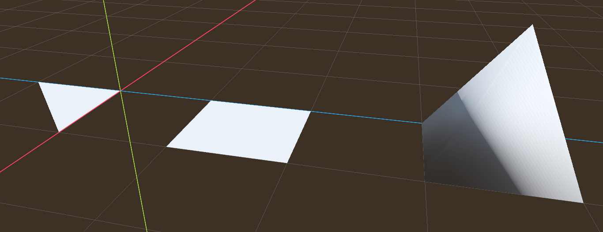

Notice also that the shading of the pyramid is somewhat strange.

## Explore the MeshInstances3D

Create a new scene with `cmd+N`, or by clicking on the + sign.
- add a root `Node3D` and rename to `MeshInstance3D`
- add a child node of `MeshInstance3D` class and rename to `BoxMesh`

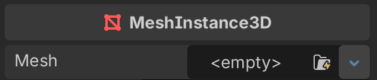{w=300px}

The **Mesh** attribute in the inspector will be empty.  
You can select among these predefined meshes. The first icon, `ArrayMesh`, is the type of mesh we created in the previous exercice.

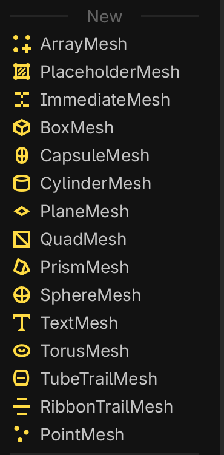{w=200px}

- select the `BoxMesh`
- then add another `MeshInstance3D` with a `CapsuleMesh` 
- and add finally a node with a `CylinderMesh`

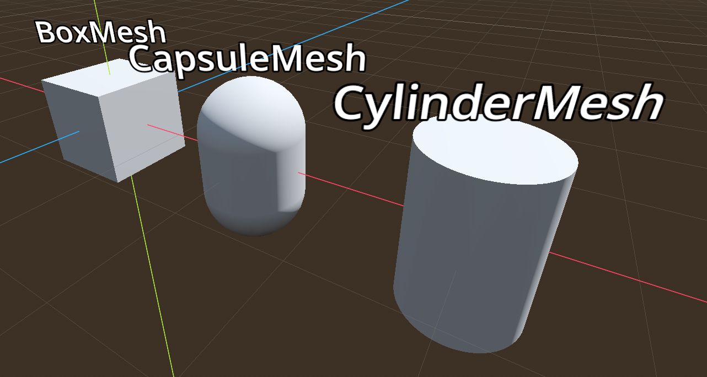

Add some more mesh instances:

- the `PlaneMesh` is a flat square which can be used as a floor.
- the `QuadMesh` is basically the same thing as the PaneMesh, but vertical.
- the `PrismMesh` is a triangular prism which can be deformed.

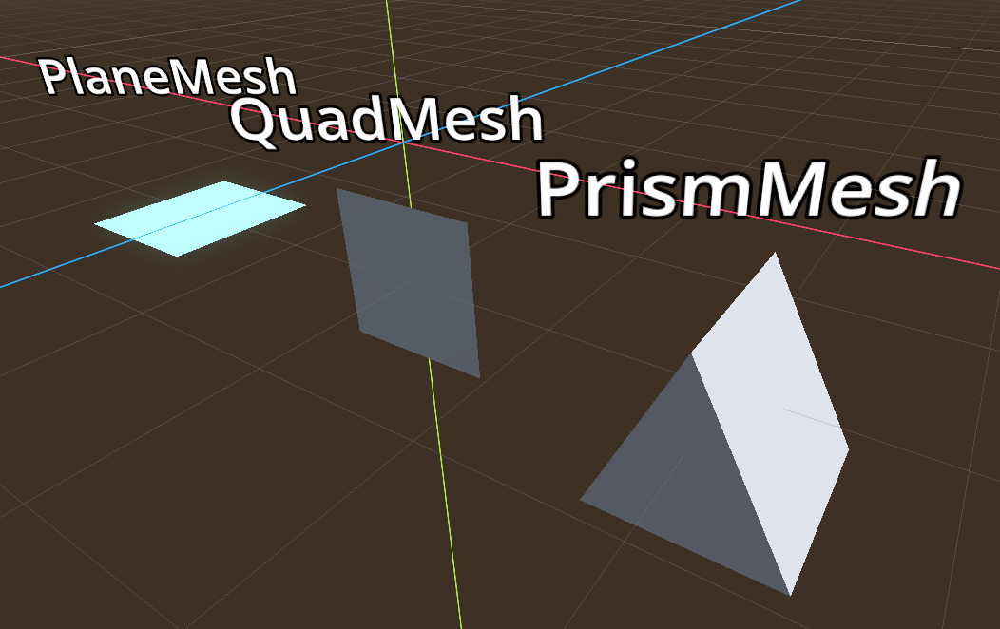

Finally add a:
- `SphereMesh`
- `TextMesh` which displays text in 3D
- `TorusMesh`

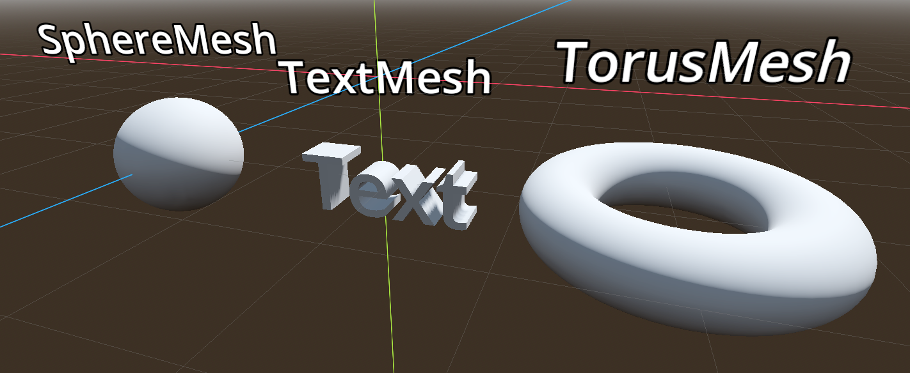

## Add an automatic label

The text on top of each mesh has been added with a `Label3D` child node.

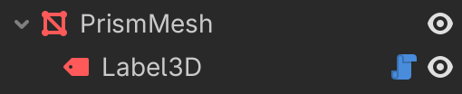{w=300px}

You notice the blue script icon.
In fact the text of the label is automatically set to be the parent's name.

```{literalinclude} mesh/label_3d.gd
:language: gd
:linenos:
```


## Exercice 1

Create the 3 shapes, which are created from a red cube and a blue sphere

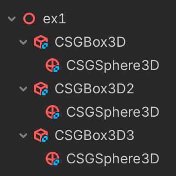{w=300px}


## Exercice 2

Create these complex shapes, which are combined with a 
- red cube 
- blue sphere
- 3 green cylinders

{w=300px}

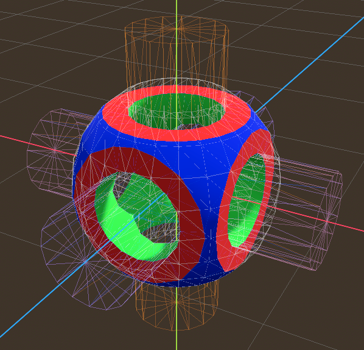


