# Work with text

There are 3 ways to display text inside a scene:

- TextMesh3D
- Label3D
- Label (2D control node)

## Introduction

Let's show these three node types by creating a small scene called `Label`.

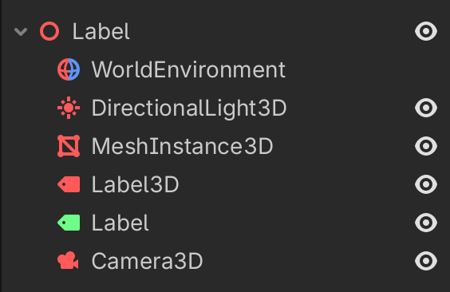{w=300}

- add a `MeshInstance3D`, select a `TextMesh` and set the text to `TextMesh`.
- add a `Label3D`, select `Flags > Y-Billboard` and set the text to `Label3D`.
- add a `Label` and set the text to `Label (2D, control)`.

In order to make the scene visible, we must add a `WorldEnvironment`, a `DirectionalLight3D` and a `Camera3D`.

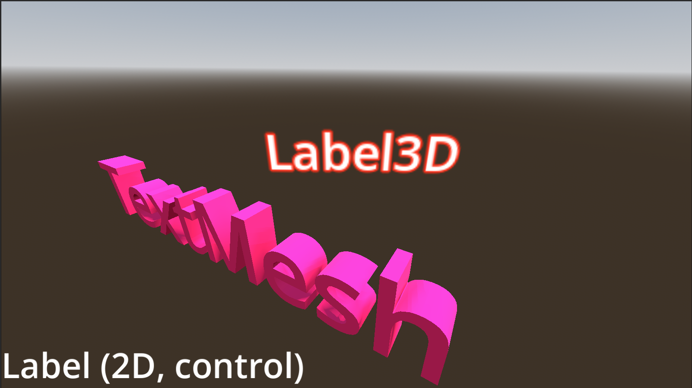

The `TextMesh` is a 3D text object. Set the albedo color to violet. 

The `Label3D` is a flat object. Seen from the back, it is transparent and the text is a mirror image. The *billboard* option allows the `Label3D` to always turn towards the camera. Set the outline to red, the font size to 32 and the outline size to 6.

The `Label` is a 2D object which is always in the same position within the camera viewport. We set the theme override font size to 80.


## Text-to-speech

The text-to-speech (TTS) functionality allows to have text pronounced automatically.

In order to use text-to-speech, you have to enable it in the project settings:

- Go to **Project > Project Settings**.
- Display **Advanced Settings**.
- Check **Audio > General > Text to Speech**.
- Restart Godot.

Depending on your OS, the voices will vary.
Text-to-speech is a function of `DisplayServer`.

There are 9 functions starting with `tts_`

- `tts_get_voices()` returns a `PackedStringArray` of voices
- `tts_get_voices_for_language(lang)` returns the voices for a given language (en, fr, de)
- `tts_is_paused()` returns true if paused
- `tts_is_speaking()` returns true if speaking
- `tts_pause()` pause speech production
- `tts_resume()` resume speech when paused
- `tts_set_utterance_callback(event: TTSUtteranceEvent, callable: Callable)`
- `tts_speak(text, voice, volume, pitch, rate)` start the speech synthesizer
- `tts_stop()` stop speech production

Create a new scene, place a `Control` node as root and name it `Speech`.
- add a `HBoxContainer` and fill all available space (anchor preset = Full Rect).
- add 3 items and select `Control > Layout > Container Sizing > Expand`.
- refer to the image below.

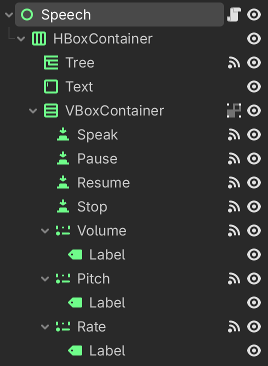{w=300}

Create global variables to access to 5 nodes we are going to use frequently.
While you drag the node from the scene tree editor into the script, press the `cmd` key.
This will automatically add the `@onready` annotation.

```
extends Control

# Pick a voice. Here, we arbitrarily pick the first English voice.
var voice_id = DisplayServer.tts_get_voices_for_language("en")[0]

@onready var tree: Tree = $HBoxContainer/Tree
@onready var text: TextEdit = $HBoxContainer/Text
@onready var volume: HSlider = $HBoxContainer/VBoxContainer/Volume
@onready var pitch: HSlider = $HBoxContainer/VBoxContainer/Pitch
@onready var rate: HSlider = $HBoxContainer/VBoxContainer/Rate
```

We configure the `Tree` control and fill it with the available voices.
- create a root node and hide it
- add a column title
- enter a loop with the languages (French, German and English)
- get the list of voices for each language
- add each voice as a child to the given language.

In the later part, we load the `TextEdit` node with the text from **Alice in Wonderland.**
```
func _ready() -> void:
	var root = tree.create_item()
	tree.hide_root = true
	tree.column_titles_visible = true
	tree.set_column_title(0, 'Voices')
	
	for lang in ['fr', 'de', 'en']:
		var parent = tree.create_item(root)
		var voices = DisplayServer.tts_get_voices_for_language(lang)
		parent.set_text(0, "%s (%s)" % [lang, voices.size()])
		for voice in voices:
			var child = tree.create_item(parent)
			child.set_text(0, voice)
		
	var path = "res://books/alice.txt"
	var file = FileAccess.open(path, FileAccess.READ)
	var content = file.get_as_text()
	text.text = content
```

In order to increase the text size of all controls, you can add a `Theme` to the root `Speech` node.
There you can set the default font size to 28.

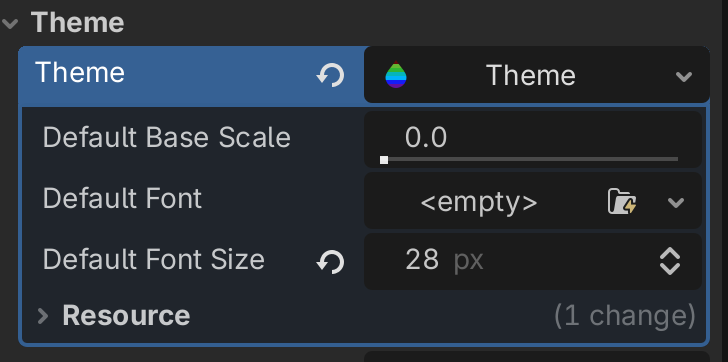{w=300px}

All of the text will now hava a larger font-size.

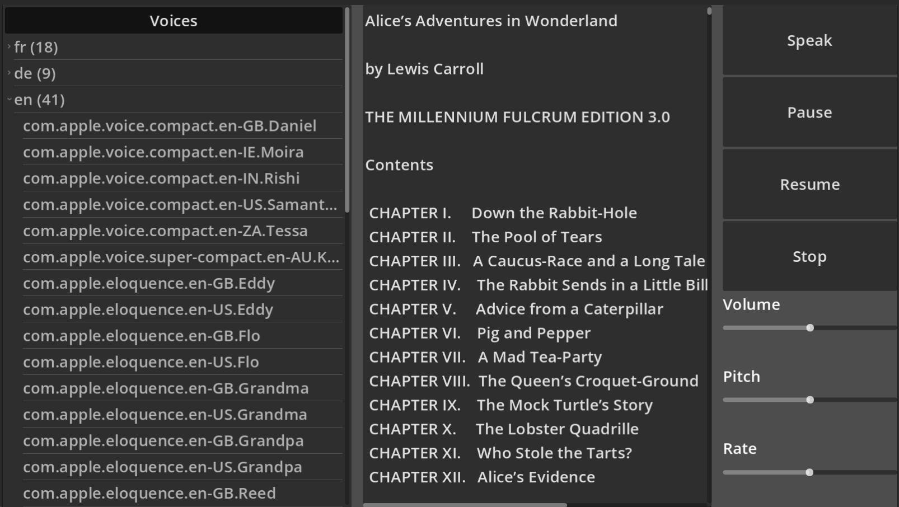

Connect each `_on_button_pressed` signal to the following functions:

```
func _on_speak_pressed() -> void:
	var selection = text.get_selected_text()
	DisplayServer.tts_speak(selection, voice_id, volume.value, 
	pitch.value, rate.value)

func _on_pause_pressed() -> void:
	DisplayServer.tts_pause()

func _on_resume_pressed() -> void:
	DisplayServer.tts_resume()

func _on_stop_pressed() -> void:
	DisplayServer.tts_stop()
```

When selecting a new voice in the `Tree` we update the global `voice_id` variable.

```
func _on_tree_cell_selected() -> void:
	voice_id = tree.get_selected().get_text(0)
	_on_stop_pressed()
	_on_speak_pressed()
```

For each of the 3 sliders, when the value changes, we stop the current speech and restart with the new parameters.

```
func _on_value_changed(x):
	_on_stop_pressed()
	_on_speak_pressed()
```

To test it do this:
- Choose a voice
- Select text with the mouse
- Click on `Speak`
- Pause with `Pause`
- Resume with `Resume`
- Modify the 3 sliders (volume, pitch, rate).

## Display a scene tree

The `Tree` control can be used to display a hierarchy. A good example of a hierarchy is the scene tree, which is displayed in the **scene editor**.

Create a new scene, place a `Control` node as root and name it `SceneTree`.
- save it and add a script
- add a `HBoxContainer` and fill it to the maximum (anchor preset = Full Rect)
- add 3 items and select **Control > Layout > Container Sizing > Expand**
- refer to the image below

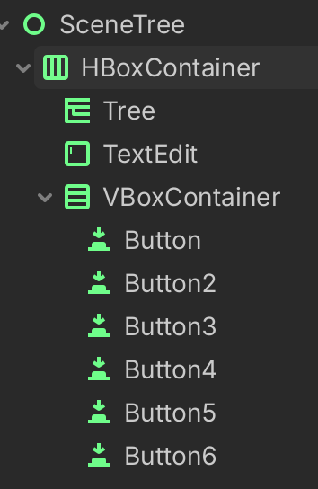{w=200}

In the script we start with 2 variables to refer to 
- `Tree` which displays the scene tree
- `TextEdit` which displays the callback functions when clicking inside the tree

```
extends Control

@onready var tree: Tree = $HBoxContainer/Tree
@onready var text: TextEdit = $HBoxContainer/TextEdit

var voice_id = DisplayServer.tts_get_voices_for_language("en")[0]
```

The main work to fill the tree is done with the recursive `add_children()` function.
- it loops through all the children for a given `node`
- creates a new child tree item
- sets name, class and path
- does recursively add the children to each child node

```
func add_children(node, item):
	for child_node in node.get_children():
		var tree = item.get_tree()
		var node_class = child_node.get_class()
		var child_item = tree.create_item(item)
		
		child_item.set_text(0, child_node.name)
		child_item.set_text(1, child_node.get_class())
		child_item.set_text(2, child_node.get_path())	
		child_item.set_metadata(0, child_node.get_path)
		add_children(child_node, child_item)
```

In the `_ready()` function, we configure the `Tree` node:
- set to 3 columns
- add the column titles
- get the root node
- create a root tree item
- start by recursively adding the children

```
func _ready() -> void:
	tree.columns = 3
	tree.column_titles_visible = true
	tree.set_column_title(0, "Node")
	tree.set_column_title(1, "Type")
	tree.set_column_title(2, "Path")
	
	var scene_root = get_tree().root
	var tree_root = tree.create_item()
	tree.hide_root = true
	add_children(scene_root, tree_root)
```

This is the result, a tree with 3 columns: 
- column 1 shows the collapsable scene tree
- column 2 shows the node type
- column 3 shows the complete node path

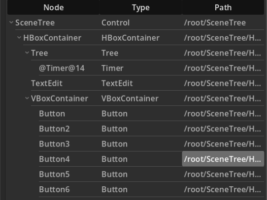

In order to show the interaction when selecting a tree cell, add the following two functions.
They add a line of text to the `TextEdit` and pronounce the cell content.

```
func _on_tree_cell_selected() -> void:
	var item = tree.get_selected()
	var row = item.get_index()
	var col = tree.get_selected_column()
	var content = item.get_text(col)
	
	text.text += "cell %s, %s selected: %s\n" % [row, col, content]
	DisplayServer.tts_stop()
	DisplayServer.tts_speak(content, voice_id)

func _on_tree_column_title_clicked(column: int, mouse_button_index: int) -> void:
	text.text += "column %s %s clicked\n" % [column, mouse_button_index ]
```

When clicking on a column header or on a cell, the following text is displayed in the text window:

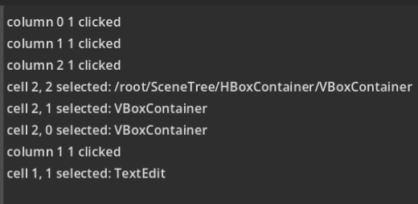{w=500}

## Configure tree items

The `TreeItems` can be configured with

- icon
- font size
- alignment
- text color and background color


Create a new scene, place a `Control` node as root and name it `TreeItem`.
- save it and add a script
- add a `HBoxContainer` and fill it to the maximum (anchor preset = Full Rect)
- add 2 items and select **Control > Layout > Container Sizing > Expand**
- refer to the image below

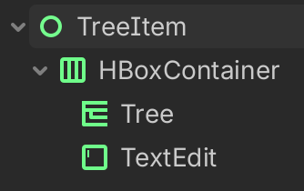{w=200}

Start by defining these variables

```
extends Control

@onready var tree: Tree = $HBoxContainer/Tree
@onready var text: TextEdit = $HBoxContainer/TextEdit

var voices = DisplayServer.tts_get_voices_for_language("en")
var voice_id = voices[0]
```

Use the `_ready()` function to create a tree root item and 3 columns

```
func _ready() -> void:
	tree.hide_root = true
	tree.columns = 3
	tree.column_titles_visible = true
	for i in 3:
		tree.set_column_title(i, "Column " + str(i))
```

Add the Godot logo as an icon. 
- change the font size
- change the icon size.

```
var root = tree.create_item()
	var icon = load("res://icon.svg")
	var item = tree.create_item(root)
	
	item.set_text(0, "text with icon")
	item.set_icon(0, icon)
	item.set_text(1, "fontsize=40")
	item.set_custom_font_size(1, 40)
	item.set_icon(2, icon)
	item.set_text(2, "icon_max_width=40")
	item.set_icon_max_width(2, 40)
```

Change the text color and the background color.

```
	icon = load("res://Tree.svg")
	item = tree.create_item(root)
	item.set_text(0, "text with icon")
	item.set_icon(0, icon)
	item.set_text(1, "custom_color=red")
	item.set_custom_color(1, Color('red'))
	item.set_text(2, "custom_bg_color=blue")
	item.set_custom_bg_color(2, Color('blue'))
```

Change the alignment.

```
	item = tree.create_item(root)
	item.set_text(0, "alignment=left")
	item.set_text(1, "alignment=center")
	item.set_text_alignment(1, HorizontalAlignment.HORIZONTAL_ALIGNMENT_CENTER)
	item.set_text(2, "alignment=right")
	item.set_text_alignment(2, HorizontalAlignment.HORIZONTAL_ALIGNMENT_RIGHT)
```

Add a parent and 3 collapsible children.

```
var parent = tree.create_item(root)
	parent.set_text(0, "Parent") 
	for i in 3:
		item = tree.create_item(parent)
		item.set_edit_multiline(0, true)
		item.set_editable(0, true)
		item.set_text(0, "Child " + str(i))
```

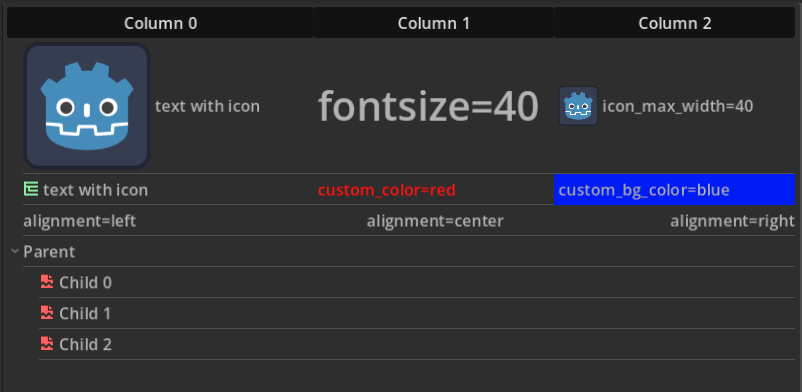

## Sort a table

The `Tree` node can be used to display tables. We create a new class with the following properties:

- `columns` = number of columns
- `rows` = number or rows
- `column_titles` = an array of titles
- clicking on a column title : sorts the table by that column

In the image below we see a 6 x 4 table, filled with random integers. It has been sorted in ascending order by the 3rd column (as shown by the the arrow). The first column has a yellow background and a red font-color. 

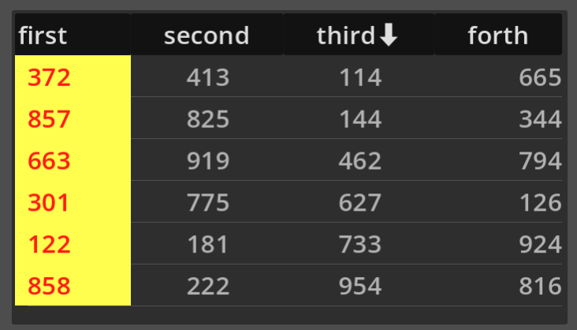

The inspector shows the 6 rows, the column titles, etc.
When clicking on a cell, the content is pronounced.

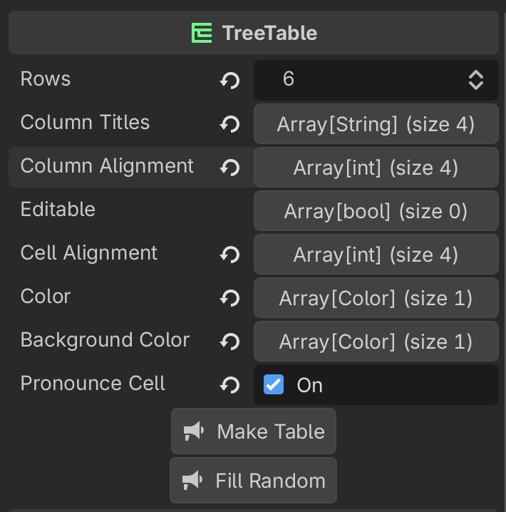{w=400px}

The script has the `@tool` annotation and makes it interactif in the editor.
We extend the `Tree` class and call it `TreeTable`. 
The exported variables allow to configure the table in the editor.

```
@tool
extends Tree
class_name TreeTable

## A control which creates an editable table based on a Tree node.
## 
## Clicking on the column titles sorts the table by column.
## All the parameters of the table can be set in the inspector.

## Number of rows to create.
@export var rows = 10
## List of column titles.
@export var column_titles : Array[String]= ['first', 'second', 'third']
## List of column title alignment (left, center, right).
@export var column_alignment: Array[HorizontalAlignment] = []

## List indicating editable columns (true).
@export var editable: Array[bool] = []
## List of column text alignment (left, center, right).
@export var cell_alignment: Array[HorizontalAlignment] = []
## List of column text colors.
@export var color: Array[Color] = []
## List of column background colors.
@export var background_color : Array[Color] = []
## Pronounce the cell content via text-to-speech.
@export var pronounce_cell = false


## Button action to create the table.
@export_tool_button("Make Table") var action = make_table
## Button action to fill the table with random integers.
@export_tool_button("Fill Random") var action1 = fill_random
```

The above code creates this new class.
All functions have a documentation comment (`##`).
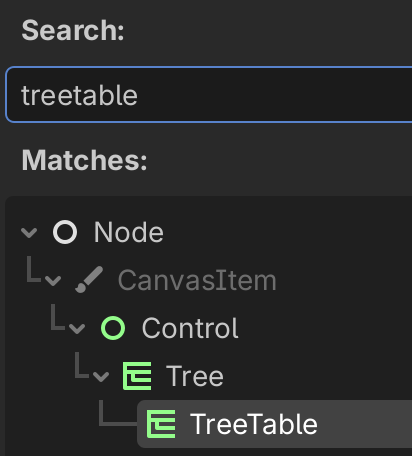{w=250px}

This new class is implemented by the following code.

```
## The voice ID used to pronounce the cell content.
var voice_id = DisplayServer.tts_get_voices_for_language("en")[0]

var root: TreeItem 		## Root tree item.
var array : Array		## Array which is displayed.
var sort_order = [true, true, true, true]  ## Sort order true=increasing.

func _ready():
	if not column_title_clicked.is_connected(_on_column_title_clicked):
		column_title_clicked.connect(_on_column_title_clicked)
		
	if not cell_selected.is_connected(_on_cell_selected):
		cell_selected.connect(_on_cell_selected)
		
	make_table()
	fill_random()

## Set the column titles and alignement.
func make_columns():
	for i in min(columns, column_titles.size()):
		set_column_title(i, column_titles[i])
	
	for i in min(columns, column_alignment.size()):
		set_column_title_alignment(i, column_alignment[i])	

## Create an empty table, with cell color and alignment.
func make_table():
	clear()
	make_columns()
	root = create_item()
	hide_root = true
	
	for i in rows:
		var row_item = create_item(root)
		for col in columns:
			row_item.set_text(col, "cell %d, %d" % [i, col])
		for col in min(columns, cell_alignment.size()):
			row_item.set_text_alignment(col, cell_alignment[col])
				
		for col in min(columns, color.size()):
			row_item.set_custom_color(col, color[col])
		for col in min(columns, background_color.size()):
			row_item.set_custom_bg_color(col, background_color[col])
		for col in min(columns, editable.size()):
			row_item.set_editable(col, editable[col])	
		
	
## Create an array with random integers (0 to 1000).
func make_random_array():
	array = []
	for i in rows:
		var line = []
		for j in columns:
			line.append(randi_range(0, 1000))
		array.append(line)


## Fill the tree with random integers.
func fill_random():
	make_random_array()
	load_array()


## Load the array into the tree table.
func load_array():
	var i = 0
	for item in root.get_children():
		for j in columns:
			item.set_text(j, str(array[i][j]))
		i += 1


## Load a new array into the tree array.
func load(new_array):
	rows = new_array.size()
	columns = new_array[0].size()
	array = new_array.duplicate(true)
	make_table()
	load_array()


## Sort an array based on a given column.
func sort_by_column(array, col, increasing=true):
	if increasing:
		array.sort_custom(func(a, b): return a[col] < b[col])
	else:
		array.sort_custom(func(a, b): return a[col] > b[col])


## Clicking on the column title sorts the table by that column.
func _on_column_title_clicked(column: int, mouse_button_index: int) -> void:
	print(column, " - ", mouse_button_index)
	sort_order[column] = not sort_order[column] 
	sort_by_column(array, column, sort_order[column])
	load_array()
	
	for i in min(columns, column_titles.size()):
		var title = column_titles[i]
		if i == column:
			title += '⬇' if sort_order[column] else '⬆'
		set_column_title(i, title)
		

## Clicking on the cell will pronounce the  content.
func _on_cell_selected() -> void:
	if pronounce_cell:
		var item = get_selected()
		var column = get_selected_column()
		var content = item.get_text(column)
		DisplayServer.tts_stop()
		DisplayServer.tts_speak(content, voice_id)
```


## Download 

Download the {download}`Godot Project <text.zip>`.