# Introduction

In this chapter we create a basic 3D scene and look at useful shortcuts.

## Create a new project

- menu `Project > Quit to Project List`
- click on `New Project`
- click star to add/remove favorites
- use filter to restrict choice
- create a new folder
- select a folder

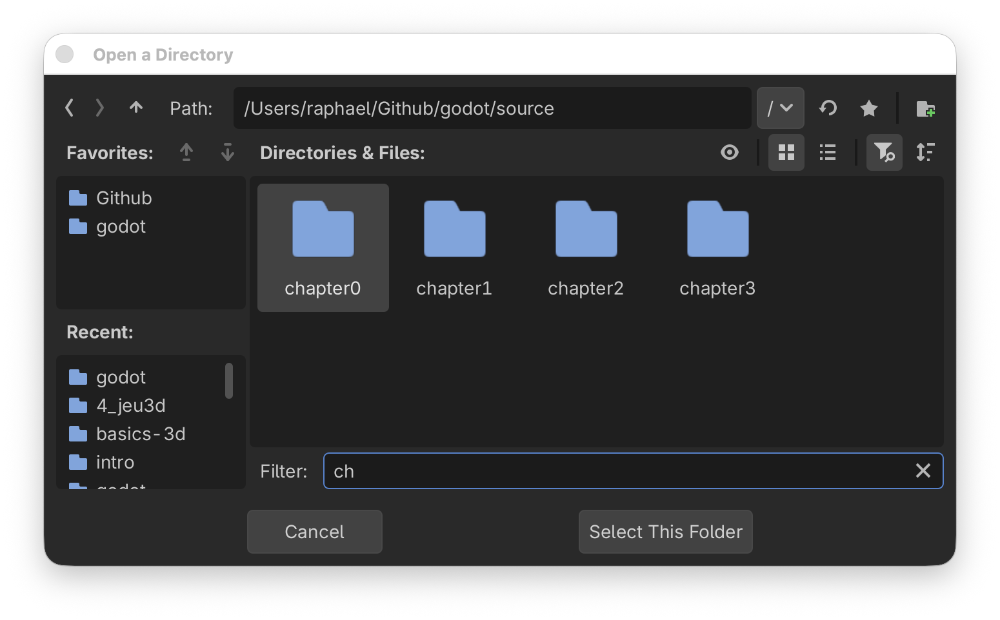

## Add nodes

- click on `Node3D` to create a root node
- press `enter` and rename it to `World` 
- use `cmd+A` to insert a new node
- search for `csgb` (search for letters in that order)
- select the `CSGBox3D`

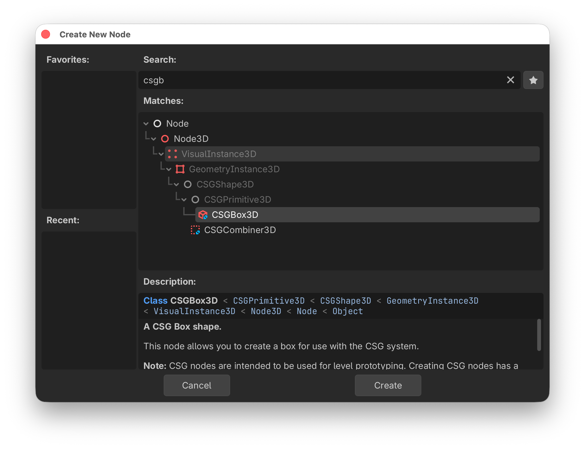

- drag the gizmo point (red dot) to create à 9x9 m box
- hold `alt` to change symmetrically

## Add more nodes

- use `cmd+D` to duplicate nodes
- use snap (`Y`) to lock to the grid
- use the gizmo (red dots) to size the box
- create 2 pillars of height 3 m
- add a top bar of 4 m lenght

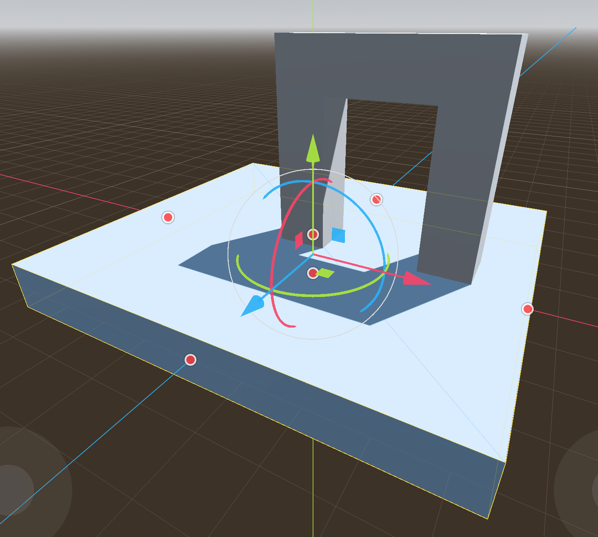

You should now have this scene tree

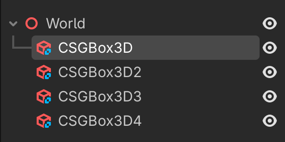{w=300px}

## Axis gismo

Whith the axis gismo you can quickly go to 
- `X` Right orthogonal view
- `Y` Top orthogonal view
- `Z` Front orthogonal view

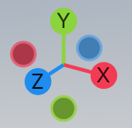

Let's check our arch in front view and correct it if necessary.

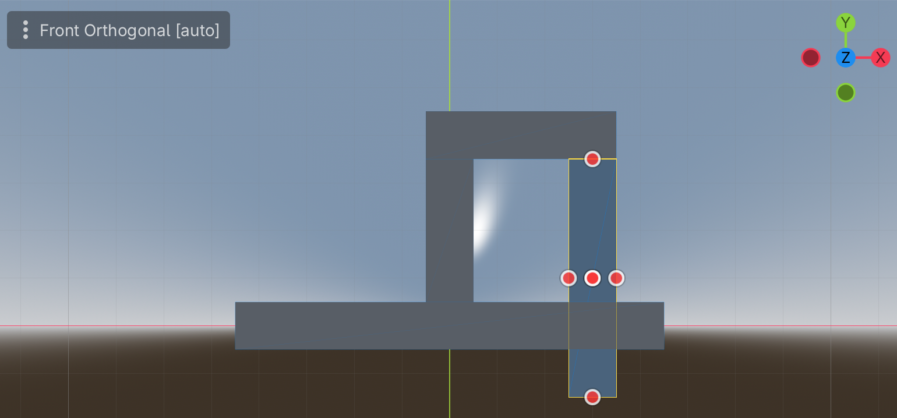


## Tools


Most of the tools have a 1-key shortcut and they lie on a row (QWER).

- `Q` move + rotate
- `W` move
- `E` rotate
- `R` scale
- `V` selection only (arrow)

The last 5 tools are:

- `M` measuring distance (triangle)
- `T` toggle global/local frame (box)
- `Y` toggle snap to grid (magnet)
- toggle sun (sun)
- toggle world environment (globe)

## Moving the view

- `O` places the origin of the axis in the center
- `F` places the selected object in the center (focus)

The mouse allows to swivel around that center point of the view
- with `V` select the top arch
- with mouse x-direction you can go 360° around the selected object
- with mouse y-direction you can go from -90° (bottom) to 90° (top)

- with `alt` + mouse-y you can zoom the camera


## Shortcuts in the editor

Here are a few tricks to speed up work with nodes:

- `cmd+D` to duplicate
- `cmd+X` to cut
- `cmd+C` to copy
- `cmd+V` to paste
- `shift+cmd+V` paste as a sibling

You can use the direction keys to navigate inside the scene tree

- `up/down` to move inside the scene tree
- `left/right` to open/collapse subtrees
- `cmd+ up/down` to move a node


## Fly mode

By pressing the `shift+F` the editor goes into fly mode:

- the mouse cursor disappears
- the `WS` keys allow to zoom the camera (get closer)
- the `AD` keys allow to move left-right
- the `QE` keys allow to move up-down
- the mouse allows to orient the camera

```{hint}
Try to fly through the arch.
```

- with `shift+F` you can quit fly mode
- pressing `shift` makes it faster
- pressing `alt` makes it slower

## Reparent

It is good practice to rename our nodes and group them. 
First lets rename the ground plate to `Floor`.

The three nodes forming the arch should be grouped. A simple `Node3D` node would be appropriated. 
- select the 3 nodes
- right-click
- select `Reparent to New Node...`

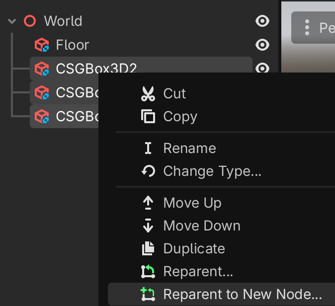{w=400px}

We obtain this tree.

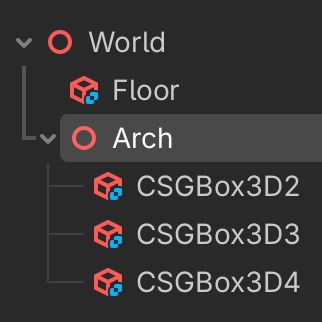{w=200px}

Now rename the three nodes to something more expressive.

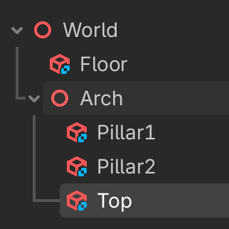{w=200px}

## Play the game

When trying to run the projects main scene (`cmd+B`) we get the following message.

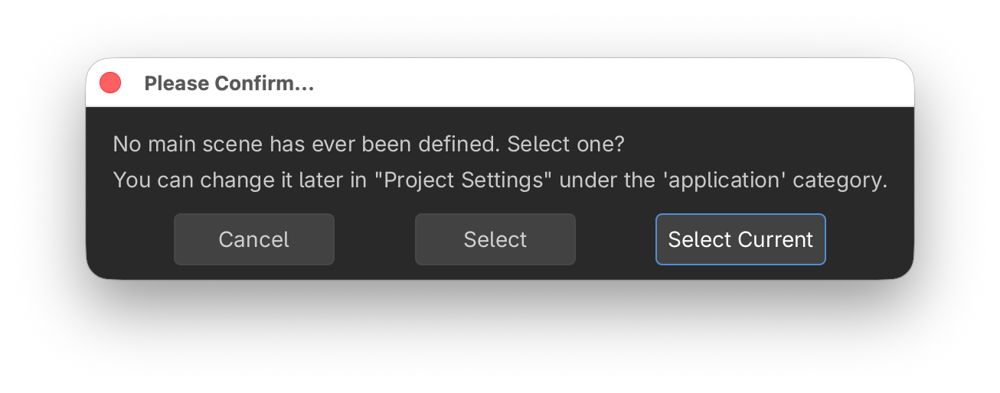

Confirm and save the scene as `world.tscn`.
Now the scene appears in the file editor.

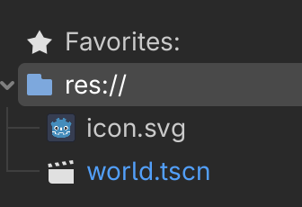{w=200px}

However the screen remains black. There is no camera and no light. 
In the meantime, let's make the window bigger, in order to display all icons on one line.

- goto menu `Project > Project Settings...``
- select `Genera > Display > Window``
- set viewport width to 1600
- set viewport height to 900

## Add a camera

- select the `World` node
- add a `Camera3D` node
- set the (move + rotate) gizmo (`Q`)
- pull the camera back 5m (blue arrow, in snap mode)
- lift the camera up 2m (green arrow)

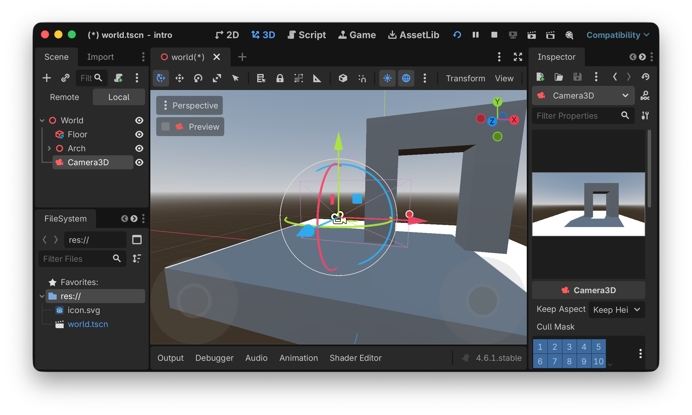

- select the camera in the scene tree (left side)
- observe the camera view in the inspector (right side)
- you can also click the Preview checkbox to see the camera view in the main window
- the camera gismo (red dot) allows to change the field of view (FOV)
- this can also be set in the inspector. Set it to 70°

Try to run the projects main scene again (`cmd+B`).
Now we see the arch, but the scene has no light.

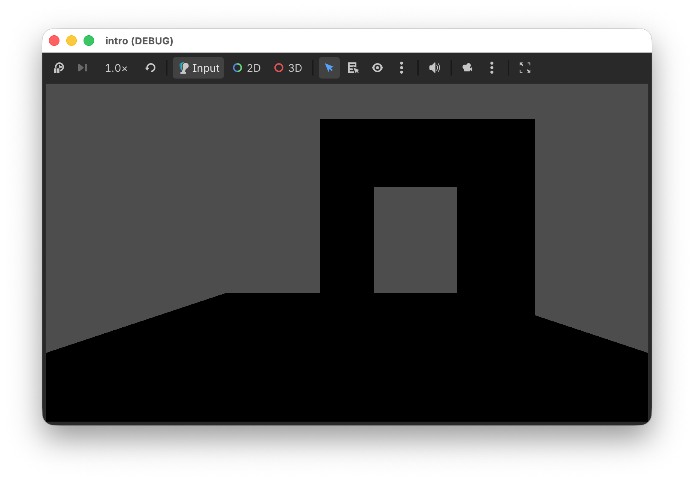

## Add light and environment

In the editor preview, sunlight and a sky and earth environment is automatically added.

In order to add it to our scene, click the 3 dots, next to the globe symbol.

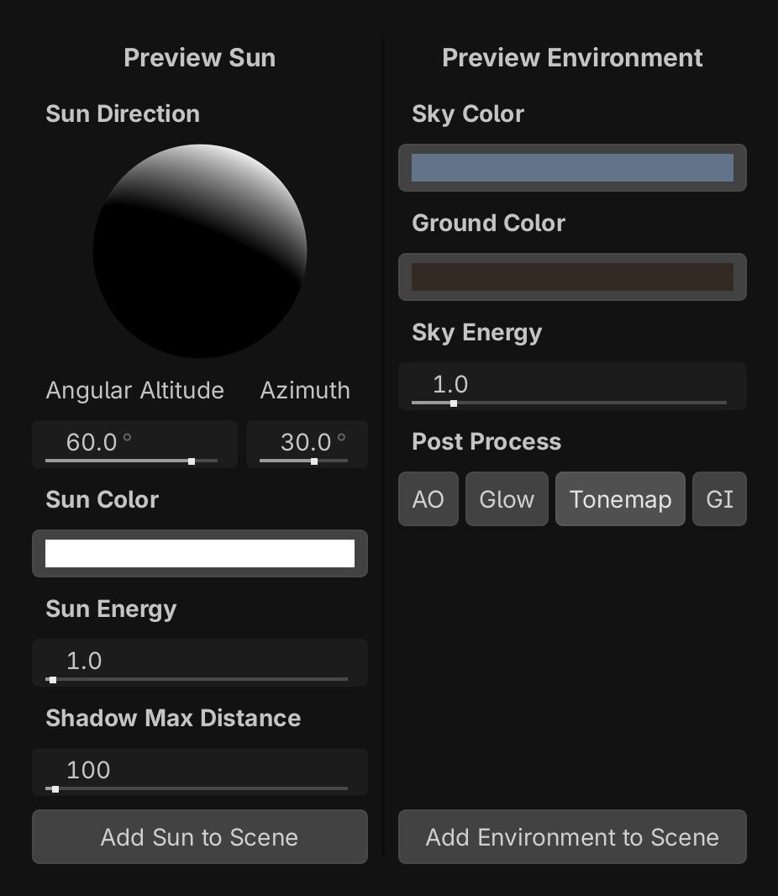{w=500}

- click on `Add Sun to Scene`
- click on `Add Environment to Scene`

We get this in the scene tree.

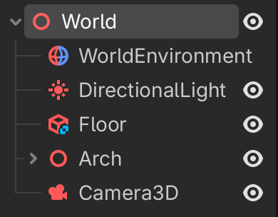

When we run the project main scene again (`cmd+B`), we now can see.

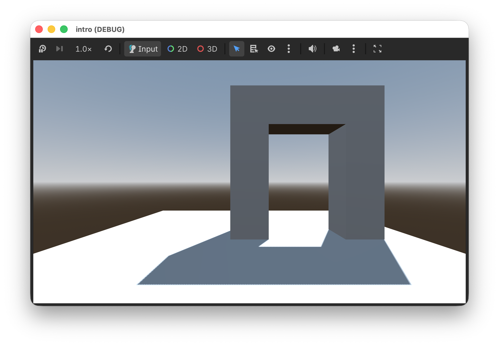

## Move the camera

Let's try to create a program which imitates the free-fly behavior we have seen in the editor. First let's define the 6 input actions.

- menu `Project > Project Settings...`
- select `Input Map`
- add and configure these 6 actions

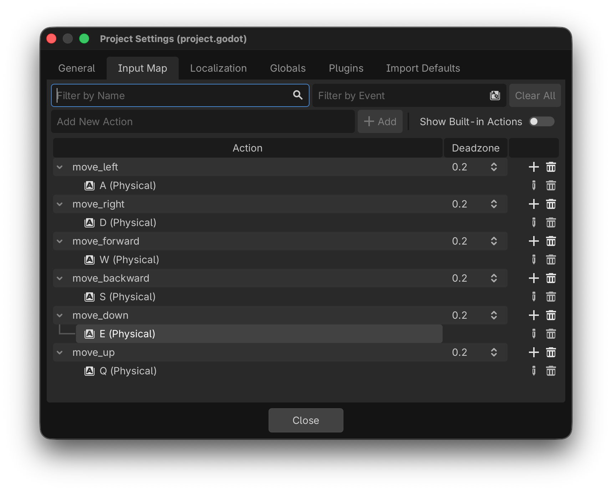

- select the Camera3D node
- attache a script
- save it

Then add this to the `_process()` function

```gdscript
func _process(delta: float) -> void:
	var input = Vector3.ZERO
	input.x = Input.get_axis('move_left', 'move_right')
	input.y = Input.get_axis('move_down', 'move_up')
	input.z = Input.get_axis('move_backward', 'move_forward')
	print(input)
```

This calculates a direction vector based on the 6 input actions.
We see something like this in the console.

````
(-1.0, 0.0, 0.0)
(-1.0, 0.0, 0.0)
(-1.0, 0.0, 0.0)
(-1.0, 0.0, -1.0)
(-1.0, 0.0, -1.0)
(-1.0, 0.0, -1.0)
(0.0, 0.0, -1.0)
(0.0, 0.0, -1.0)
````

Now we use this value to change the position of the camera

```
func _process(delta: float) -> void:
	var input = Vector3.ZERO
	input.x = Input.get_axis('move_left', 'move_right')
	input.y = Input.get_axis('move_down', 'move_up')
	input.z = Input.get_axis('move_forward', 'move_backward')
	position += basis * input * 0.1
```

## Rotate the camera

To change the camera rotation, we will use not the mouse, but the direction keys.
They have built-in actions already.

- we initialize direction with `Vector2.ZERO`
- we use `Input.get_axis()` to get the axis value (-1, 1) for two oposing keys
- we accumulate the input direction in a 2D vector `tilt`
- this is used to adjust the camera rotation

```
	var dir = Vector2.ZERO
	dir.x = Input.get_axis("ui_left", "ui_right")
	dir.y = Input.get_axis("ui_down", "ui_up")
	
	if dir:
		tilt += dir * 0.05
		tilt.y = clamp(-PI/2, tilt.y, PI/2)
		basis = Basis()
		rotation.y = tilt.x
		rotation.x = tilt.y
		print(tilt)
```

## Finished program

```{literalinclude} intro/camera_3D.gd
:language: gd
:linenos:
```

## Web export

- Go to `Project > Export`
- Add `Web`

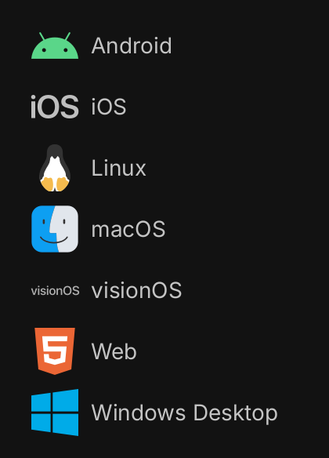{w=200}

We can export the project for one or several platforms.

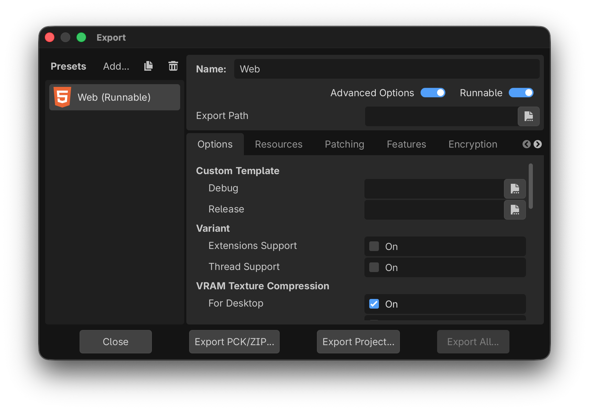

Export the project into a separate folder.

[Play the project online](../intro.html){.external}

## Pack the project as ZIP

Finally let's export the project as a ZIP file.
Go to `Project > Pack Project as ZIP`

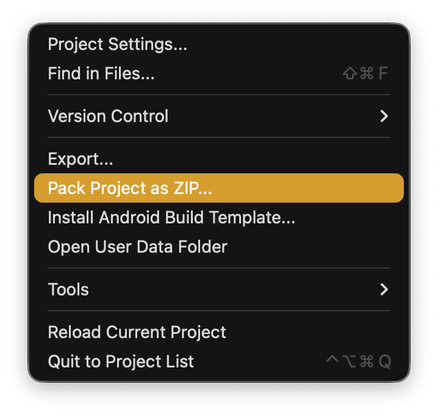{w=400}

Download the {download}`Godot Project <intro.zip>`.