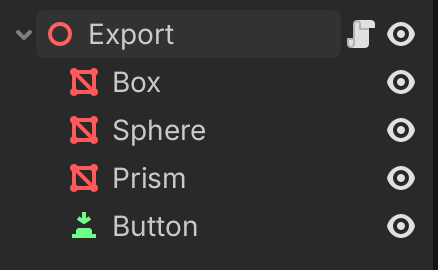
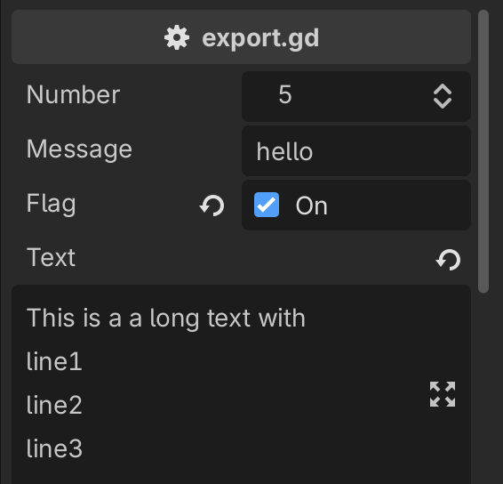
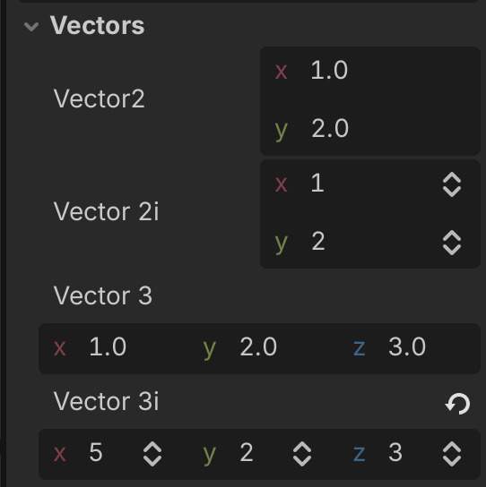
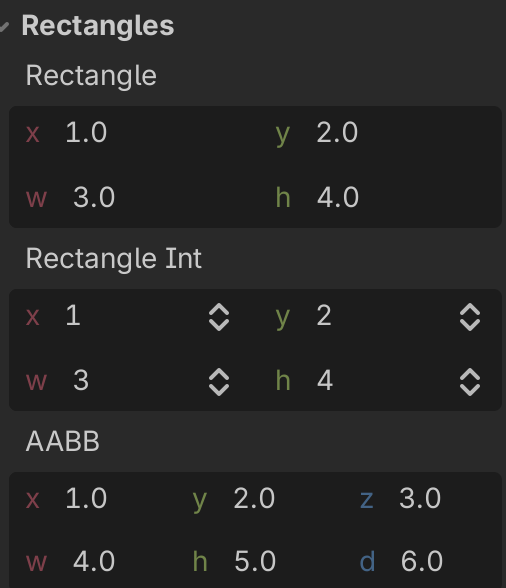
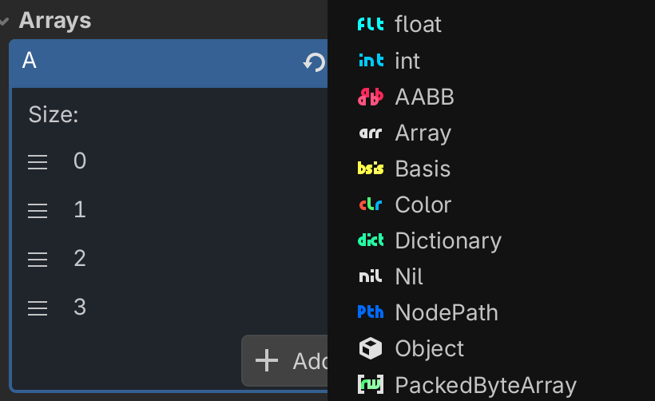
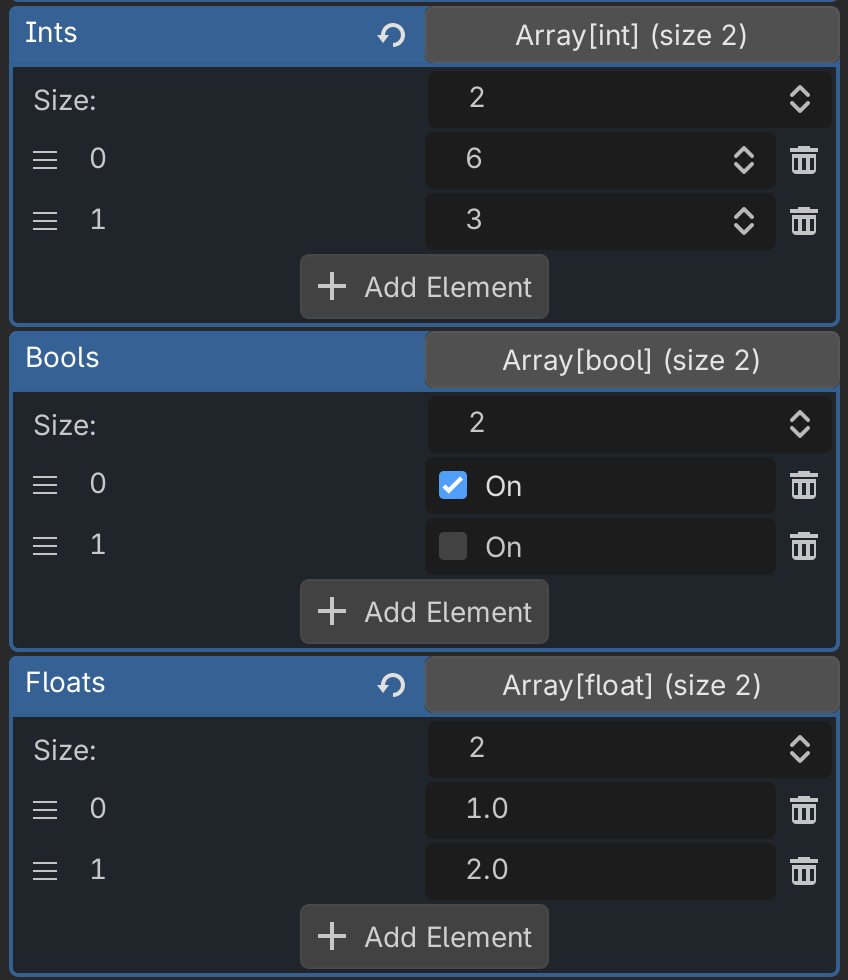
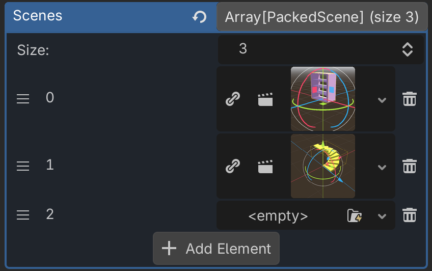

# Export properties

[View the game](../text.html){.external}

[Play the project online](../_static/text/text.html){.external}

## Introduction

In Godot, class members (properties, attributes) can be exported. They are saved along with the scene.

Also, they can be edited by the inspector. This allows us to create new nodes, which are configurable.

## Create a scene

Create a new scene with 

- Node3D
- 3 MeshInstance3D (box, sphere, prism)
- Button

{w=300px}

Arrange the 3 objects like this.


Attach a script to the node and call it `export.gd`
use the `@export` directive to export the following variables :

- an integer (`int`)
- a text (`String`)
- a flag (`bool`)
- a multiline text

```godot
extends Node3D

@export var number: int = 5 ## Integer variable
@export var message: String = "hello" ## Text string
@export var flag = false ## Boolean flag
@export_multiline var text = "Long text with\nline1\nline2\nline3"
```

This produces the following in the inspector.

- an integer control with up/down arrows
- a clickable checkbox
- a return arrow to return to the default value
- an editor icon for the multiline text

{w=300px}

## Export vectors

The `@export_group("Vectors")` directive adds a collapsible title to the variable group.
There are 2 types: 2D and 3D vectors. They have 2 varieties:

- integer (with up/down arrows)
- floating point

```
@export_group("Vectors")
@export var vector2 =  Vector2(1, 2)
@export var vector2i =  Vector2i(1, 2)
@export var vector3 =  Vector3(1, 2, 3)
@export var vector3i =  Vector3i(1, 2, 3)
```

{w=300px}

## Export rectangles

The 2D rectangle has a position (`x, y`) and a size (`w, h`)

```
@export_group("Rectangles")
@export var rectangle =  Rect2(1, 2, 3, 4)
@export var rectangle_int =  Rect2i(1, 2, 3, 4)
@export var aabb =  AABB(Vector3(1, 2, 3), Vector3(4, 5, 6))
```

There is a 3D version, which is called AABB (Axis-Aligned Bounding Box).

{w=300px}

## Export arrays

An array with no specified array type can have a mix of different types.
With a generic array, you can

- Choose the array size (up/down arrow)
- Reposition an element by dragging
- Chose a type (float, int, AABB, etc.) with the **pen icon**
- Add an element with the (+) button
- Remove the last element with the down button

```
@export var a = [1, 2, 3]
```
{w=400px}

If the type is specified, the array only accepts one type.

```
@export var ints: Array[int] = [1, 2, 3]
@export var bools: Array[bool] = [true, false]
@export var floats: Array[float] = [1, 2, 3]
```

{w=400px}

With arrays you can

- rearrange the position
- modify the value
- remove an element
- add a new element

## Export a PackedScene Array

This control allows to select multiple scenes.

```
@export var scenes: Array[PackedScene]
```


{w=400px}


