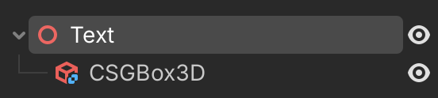
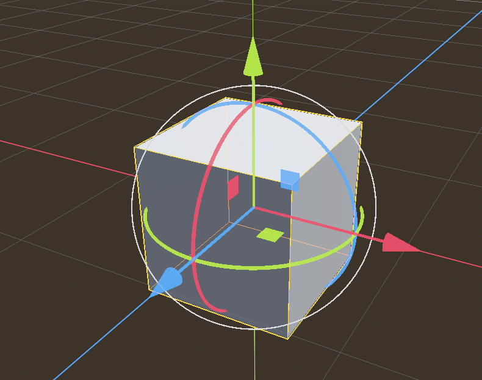

# Working with text

[View the game](../text.html){.external}

## Introduction

- display text in the GUI interface
- display text attache to a 3D object
- show dialog boxes



produces this



## Include code

```{literalinclude} ./text/text.gd
:language: gdscript
:linenos:
```

without line numbers

```{literalinclude} ./text/text.gd
:language: gdscript
```


## Download links

Download a {download}`Godot Script <text/text.gd>`.

Download a {download}`Godot Scene <text/text.tscn>`.

Download a {download}`Godot Project <text.zip>`.


## View the game


