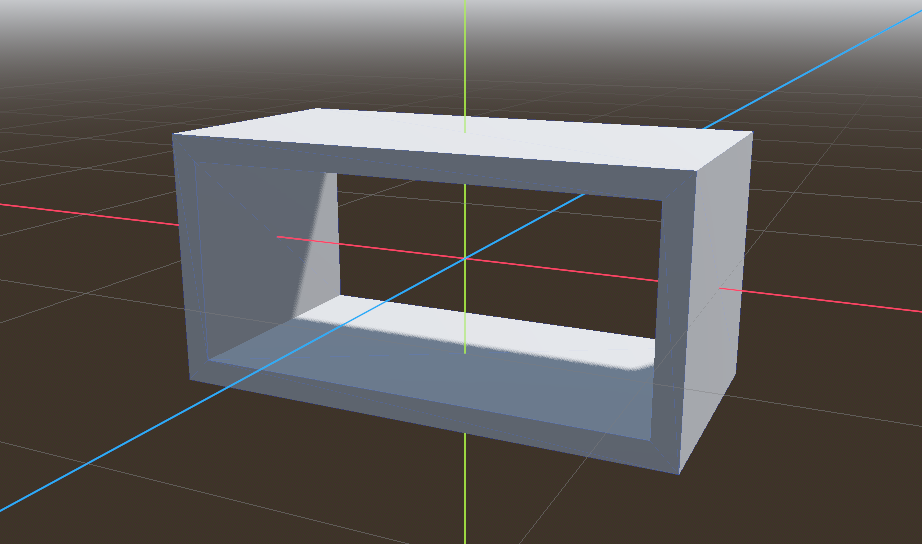
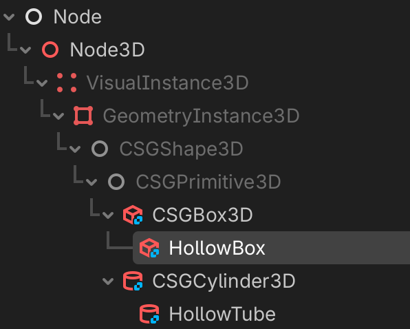
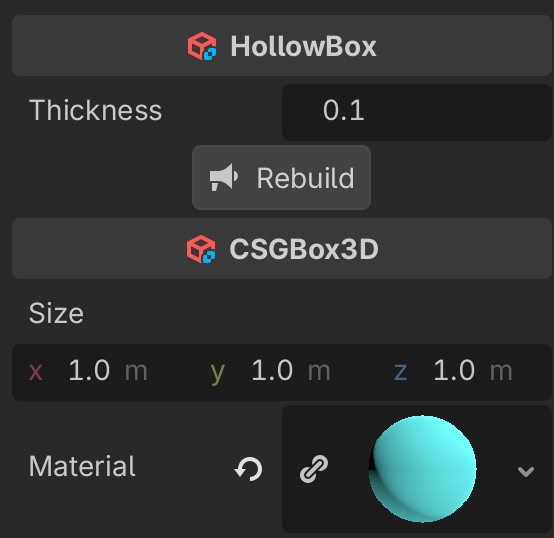
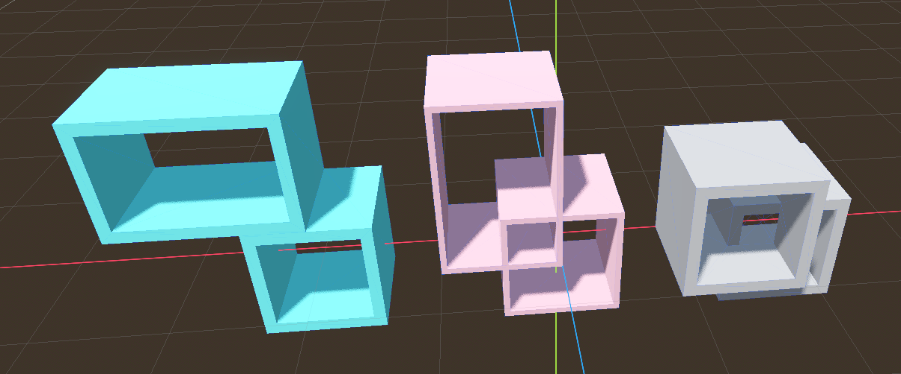
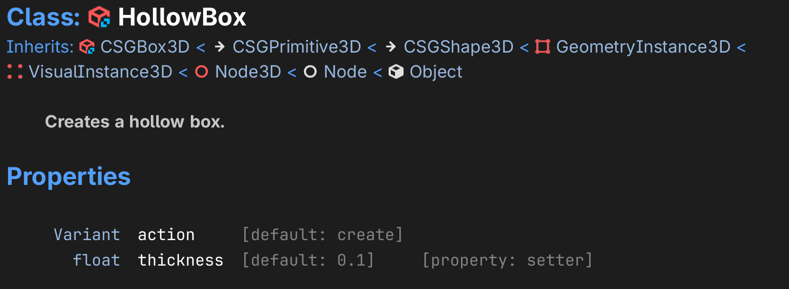
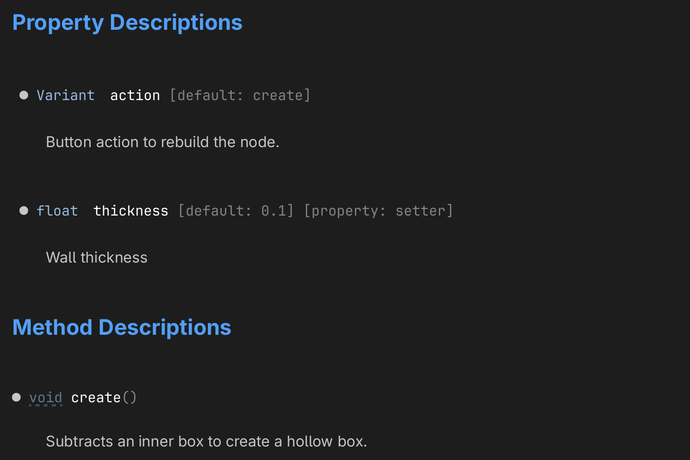
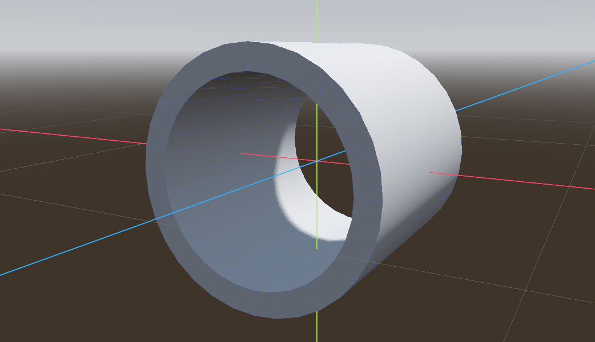
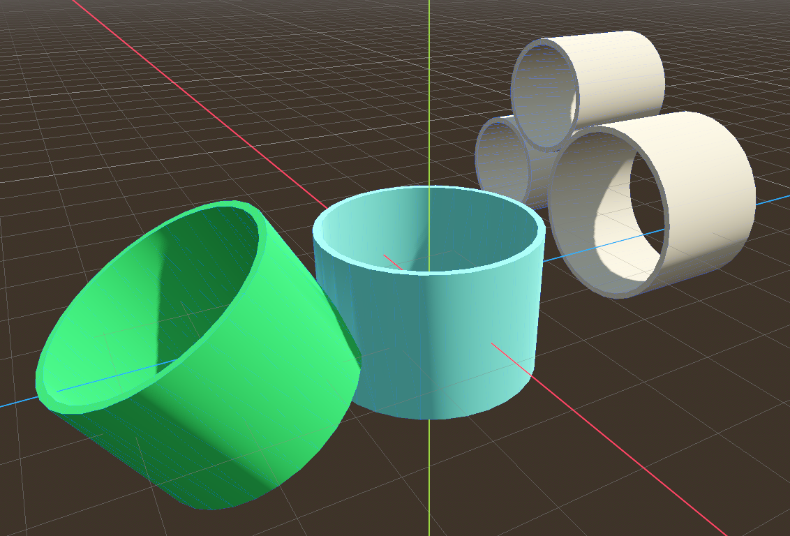

# Execute code in the editor

[Preview the game](../basics.html){.external}

The `@tool` directive allows us to execute code in the editor. 
This is a convenient preview function. It allows to:

- animate nodes directly in the editor
- to create nodes programmatically and interactively

## Rotate a box

To show how to create a rotating cube, create a new scene with the following nodes:

- a `Node3D` as a base node called `Tool`
- a `WorldEnvironment` to have light
- a `CSBBox3D` renamed `Rotate`
- a `Camera3D` to see the object (moved backward 2m along the z-axis)

{w=300}

This is the static image you get in the editor.


Add a script to the `Rotate` node, which appears as a **white** script icon.
The script makes the box rotate around the x-axis.

```
extends CSGBox3D

var speed = 1

func _process(delta: float) -> void:
	rotation.x += delta * speed	
```

With `cmd+R` the game can be played. We see a cube rotating around the x-axis. The cube only rotates while in the game, not in the editor.


## Execute in the editor

Adding the directive `@tool` at the beginning of the script allows to play the script in the editor as well. It allows to animate nodes by executing code in the `_process()` function.

```
@tool
extends CSGBox3D

var speed = 1

func _process(delta: float) -> void:
	rotation.x += delta * speed	
```

```{attention}
Each time you make a change in the script, the scene must be reloaded with `Scene > Reload Saved Scene`.
```

The script icon now turns **blue** to indicate that the script is executed in the editor via the `@tool` directive.

{w=300}

This is the static image you get in the editor.


Try to change the speed and reload the scene.

## Move a cube

Now add a second cube.
Attach the following script.

{w=300}

First we calculate the current time by accumulating the time `delta` to the variable `t`. The `sin()` function is used to move the cube up and down along the y-axis.

```
@tool
extends CSGBox3D

var speed = 1
var t = 0.0

func _process(delta: float) -> void:
	t += delta
	position.y = sin(t * speed)
```

The first box rotates, the second box moves up and down.


## Change parameters in the inspector

It is possible to export the parameters and configure them in the inspector.

The `@export` directive exports the value:

- it can be changed in the inspector
- it will be saved with the scene

In order to change the speed from within the running script, we must use a **setter** function `set(x)`. 

```
@tool
extends CSGBox3D

@export var speed = 3:
	set(x):
		speed = x

func _process(delta: float) -> void:
	rotation.x += delta * speed	
```

Now we can speed up the rotation, make it zero, or even inverse the direction.

## Change speed and amplitude

For the moving cube, we can add two parameters: speed and amplitude.

```
@tool
extends CSGBox3D

@export var speed = 1:
	set(x):
		speed = x
		
@export var amplitude = 1:
	set(x):
		amplitude = x
		
var t = 0.0

func _process(delta: float) -> void:
	t += delta
	position.y = amplitude * sin(t * speed)
```

## Create a hollow box

In Godot it is possible to create new types of node objects. For example, it would be convienent to have not just a filled box, but also a hollow box. We can take an existing type and modify it.



- create an `addons` folder
- create a new script file called `hollow_box`
- add the following code:

```
@tool
extends CSGBox3D
class_name HollowBox
## Creates a hollow box.
```
First we make it execute in the editor (editor tool). 
This script extends the `CSGBox3D`. The new class name is `HollowBox`
This already adds the new class as a child of `CSGBox3D`. You can test this by adding a new node to a scene (cmd+A).

{w=300}

Now we add an exported variable, which lets us select the thickness of the wall. 
We use a **setter** function to set the new value and also to call the function `create()`.

```
@export var thickness := 0.1:
	set(value):
		thickness = value
		create()

## Button action to rebuild the hollow tube.
@export_tool_button("Rebuild") var action := create
```

The `thickness` and the `action` button appear in the inspector panel.  
We can change the wall thickness and rebuild the node.

The size and material of the outer box are selected with the original `CSGBox3D` attributes.

{w=300}

The `_ready()` function creates the inner CSG box, which is subtracted from the base box.

```
func _ready():
	create()
```

The `_ready()` function first looks for a procedurally created node. 
A procedurally created node does not have a parent.
If we find a node without an owner, this is our `inner` tube.

```
func create():
	var inner = null
	# find a procedurally created node
	for child in get_children():
		if child.owner == null:
			inner = child
			break
```

If `inner` does not exist, we create a new box and add it as a child.
We set up the operation to **subtraction**.

```
	if inner == null:
		inner = CSGBox3D.new()
		add_child(inner)
		inner.operation = CSGShape3D.OPERATION_SUBTRACTION
```

If the outer box has a material, we want to make the inside the same.
The size of the inner box is smaller by the `thickness` in the x and y direction.

```
	if material:
		inner.material = material
	inner.size = size
	inner.size.x -= thickness * 2
	inner.size.y -= thickness * 2
	inner.size.z += 0.01 # Slightly taller to avoid "Z-fighting" or thin faces
```



Download the {download}`Godot Script <tool/addons/hollow_box.gd>`.

## Create automatic documentation

All comments preceded by `##` will be added as description. 

```
## Creates a hollow box.
```




The help description for exported variables can be :
- an inline description (`thickness`)
- placed on the previous line (`action`)

```
@export var thickness := 0.1:  ## Wall thickness.

## Button action to rebuild the node.
@export_tool_button("Rebuild") var action = create
```



## Hollow Tube

Now lets create a hollow tube, by subtracting an inner cylinder from a `CSGCylinder3D` node.



In the `addons` folder create a new file called `hollow_tube.gd`.

First make the script a tool with the `@tool` annotation so we can use it interactively.
Then extend the `CSGCylinder3D` class to create a new class called `HollowTube`.
Add a help comment with `##`.

```
@tool
extends CSGCylinder3D
class_name HollowTube
## Creates a hollow tube.
```

Again, export the `thickness` variable and an `action` button. Add a help comment to them.

```
@export var thickness := 0.1:  ## Wall thicknness.
	set(value):
		thickness = value
		create()

## Button action to rebuild the hollow tube.
@export_tool_button("Rebuild") var action := create
```

The `_ready()` function creates the hollow tube once the node is ready, after joining the scene tree.

```
func _ready():
	create()
```

Like before, check if a procedurally created node exists already. If not, create one.

```
## Subtracts an inner cylinder from the `CSGCylidner3D`.
func create():
	var inner = null
	# find a procedurally created node
	for child in get_children():
		if child.owner == null:
			inner = child
			break
			
	# create one if it does not exist
	if inner == null:
		inner = CSGCylinder3D.new()
		inner.operation = CSGShape3D.OPERATION_SUBTRACTION
		add_child(inner)
```
Finally update the inner cylinder.
Make the radius smaller by the wall thickness. 
Make the height slightly larger to avoid "z-fighting".

```
	# update it
	if material:
		inner.material = material
	inner.radius = radius - thickness
	inner.height = height * 1.01 # Slightly taller to avoid "Z-fighting" or thin faces
	inner.sides = sides
	inner.cone = cone
```

Download the {download}`Godot Script <tool/addons/hollow_tube.gd>`.




Download the {download}`Godot project <tool.zip>`.


