# Execute code in the editor

[Preview the game](../basics.html){.external}

The `@tool` directive allows us to execute code in the editor. 
This is a convenient preview function. It allows to 

- animate nodes directly in the editor
- to create nodes programmatically and interactively

## Rotate a box

To show how to create a rotating cube, create a new scene with the following nodes:

- a `Node3D` as base node called `Tool`
- a `WorldEnvironment` to have light
- a `CSBBox3D` renamed `Rotate`
- a `Camera3D` to see the object (moved backward 2m along the z-axis)

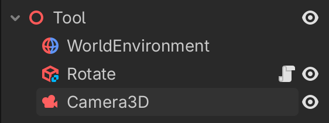{w=300}

This is the static image you get in the editor.

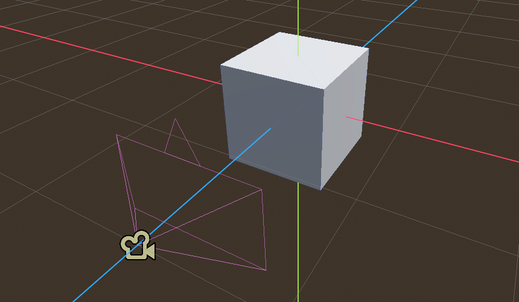


Add a script to the `Rotate` node, which appears as a **white** script icon.
The script makes the box rotate around the x-axis

```
extends CSGBox3D

var speed = 1

func _process(delta: float) -> void:
	rotation.x += delta * speed	
```

With `cmd+R` the game can be played. We see a cube rotating around the x-axis. The cube only rotates while in the game, not in the editor.

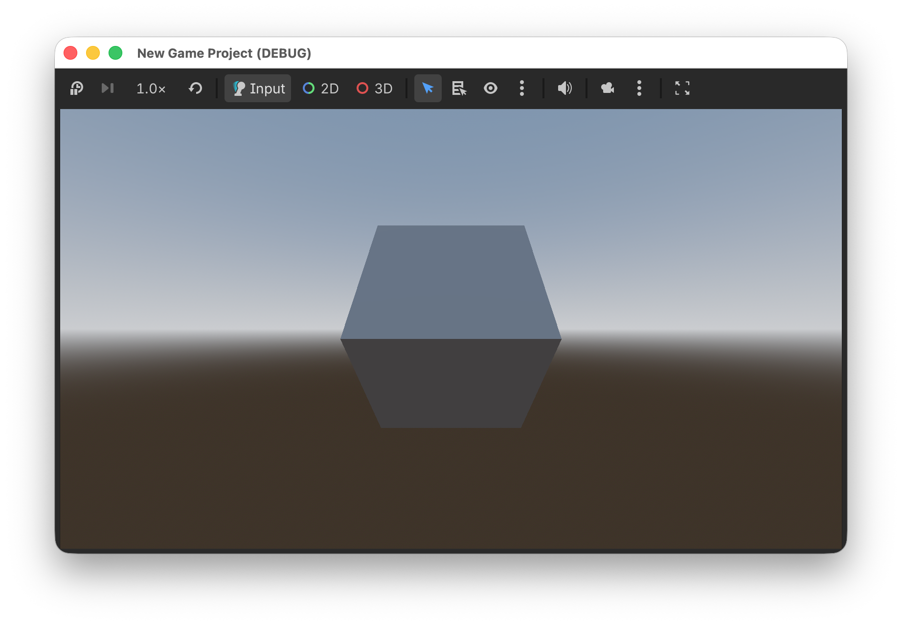

## Execute in the editor

Adding the directive `@tool` at the beginning of the script allows to play the script in the editor as well. It allows to animate nodes by executing code in the `_process()` function.

```
@tool
extends CSGBox3D

var speed = 1

func _process(delta: float) -> void:
	rotation.x += delta * speed	
```

```{attention}
Each time you make a change in the script, the scene must be reloaded with `Scene > Reload Saved Scene`.
```

The script icon now turns **blue** to indicate that the script is executing in the editor via the `@tool` directive.

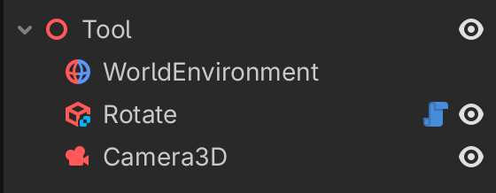{w=300}

This is the static image you get in the editor.

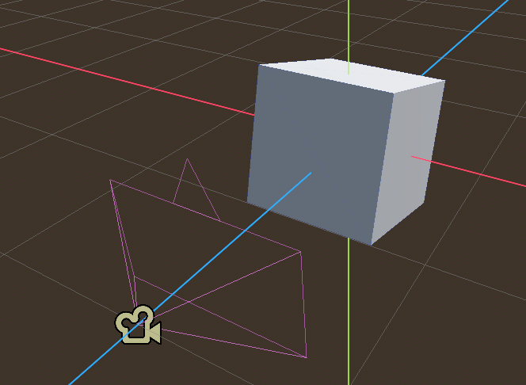

Try to change the speed and reload the scene.

## Move a cube

Now add a second cube.
Attach the following script.

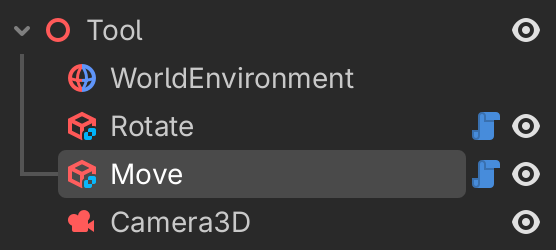{w=300}

First we calculate the current time by accumulating the time `delta` to the variable `t`. The `sin()` function is used to move the cube up and down along the y-axis.

```
@tool
extends CSGBox3D

var speed = 1
var t = 0.0

func _process(delta: float) -> void:
	t += delta
	position.y = sin(t * speed)
```

The first box rotates, the second box moves up and down.

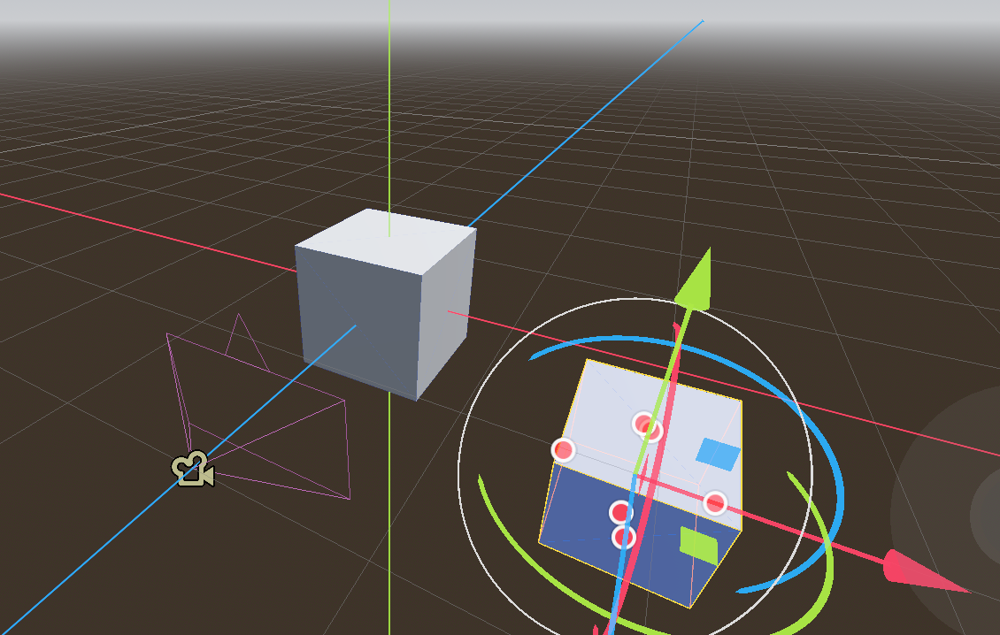


## Change parameters in the inspector

It is possible to export the paramters and configure them in the inspector.

The `@export` directive exports the value:

- it can be changed in the inspector
- it will be saved with the scene

In ordre to change the speed in the running script we must use a **setter** function `set(x)`. 

```
@tool
extends CSGBox3D

@export var speed = 3:
	set(x):
		speed = x

func _process(delta: float) -> void:
	rotation.x += delta * speed	
```

Now we can speed up the rotation, make it zero, or even inverse the direction.

## Change speed and amplitude

For the moving cube, we can add two parameters: speed and amplitude

```
@tool
extends CSGBox3D

@export var speed = 1:
	set(x):
		speed = x
		
@export var amplitude = 1:
	set(x):
		amplitude = x
		
var t = 0.0

func _process(delta: float) -> void:
	t += delta
	position.y = amplitude * sin(t * speed)
```


# Basics

## World environment

We start with creating the world environment

- configure snap to 0.5
- create a CSGBox3D of 10x1x10
- use collision on
- add environment to scene
- add Sun to scene


## Player

The player is the object representing the user. A camera is attached to the player in order to see the world.

```{image} ./images/player_tree.png
:width: 300px
```

Create the objects as indicated:

- Create a **RigidBody3D** node and name it `Player`
- Add a **MeshInstance3D** and make it a capsule shape
- Add a **CollisionShape3D** via the `Mesh` button (sibling, capsule)
- Add a Node3D and name it `TwistPivot`
- Add a child Node3D and name it `PitchPivot`
- Add a child Camera3D


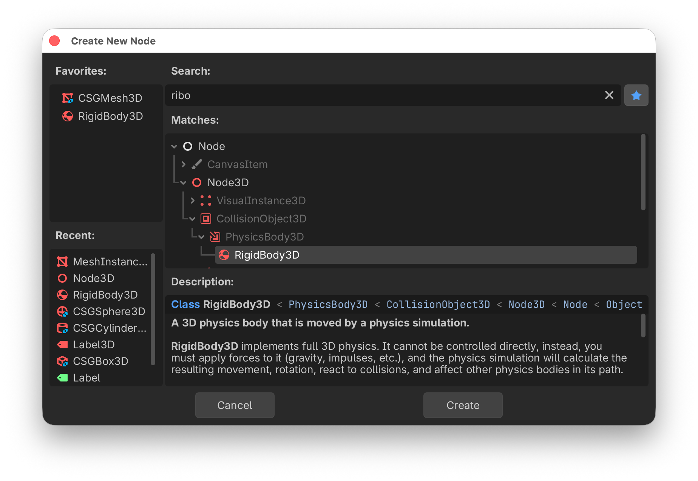

This is the GDScript to move the player.

## This

```{literalinclude} ./basics/player.gd
:language: gd
:start-at: func _input
:end-before: func _ready
```


## All

```{literalinclude} ./basics/player.gd
:language: gd
```

## Creating a box

The following code creates a CSG box programmatically.

The `@tool` directive allows to execute the programme in the editor.

The `size` of the box and the `material` is exported to the inspector panel.

```{image} ./images/box_inspector.png
:width: 400px
```


The corner of the box is aligned with the origin by offsetting the box by half of its size: 
`box.position = 0.5 * size`

```gd
@tool
extends Node3D
class_name Box
## This class creates a Box.

## The size of the box.
@export var size = Vector3(2, 1, 4):
	set(x):
		size = x
		create()
		
## The box material.
@export var material: BaseMaterial3D		

		
func _ready():
	create()
	
## Creating the box.
func create():
	for child in get_children():
		child.queue_free()
	
	var box	
	box = CSGBox3D.new()
	box.size = size
	box.position = 0.5 * size
	box.material = material
	box.use_collision = true
	add_child(box)
```

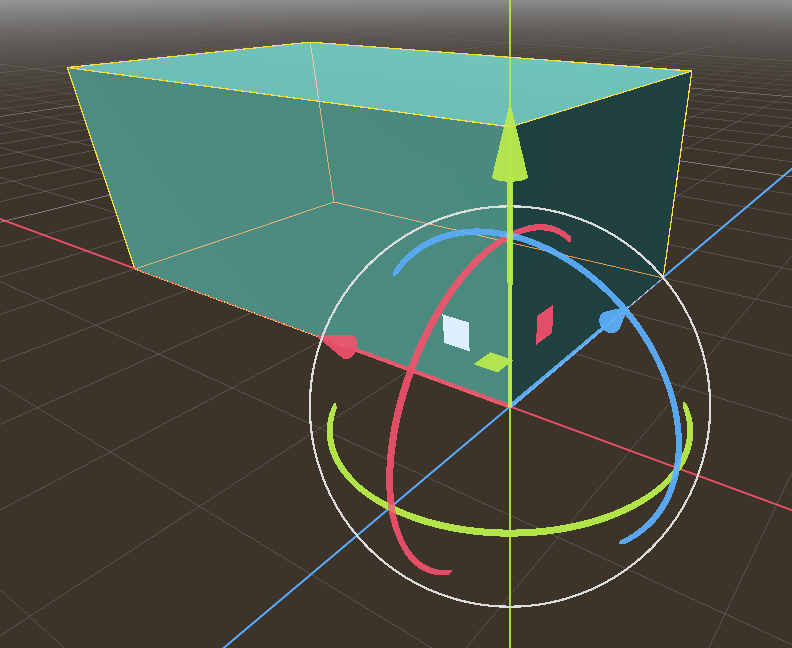


## Staircase

The following shows how to build a staircase. We place a first step.

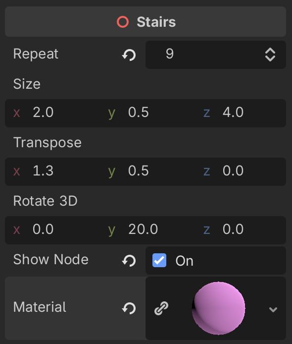

```gdscript
@tool
extends Node3D
## This class creates a staircase.
class_name Stairs

## Number of steps.
@export var repeat = 18:
	set(x):
		repeat = x
		if is_node_ready():
			create()
		
## Size of a step.
@export var size = Vector3(2, 0.5, 4):
	set(x):
		size = x
		if is_node_ready():
				create()
		
## Transposition vector (offset).
@export var transpose = Vector3(1.3, 0.5, 0):
	set(x):
		transpose = x 
		create()
		
# Euler angles of rotation
@export var rotate_3d = Vector3(0, 20, 0):
	set(x):
		rotate_3d = x
		create()

# Show nodes in scene tree		
@export var show_node = false:
	set(x):
		show_node = x
		create()

# Staircase material		
@export var material: BaseMaterial3D		

		
func _ready():
	create()
	
	
func create():
	for child in get_children():
		child.free()
	
	var box	
	box = CSGBox3D.new()
	box.name = "Step"
	box.size = size
	box.position = 0.5 * size
	box.material = material
	box.use_collision = true
	add_child(box)
	if show_node:
		box.owner = get_tree().edited_scene_root
	
	for i in (repeat):
		box = box.duplicate()
		box.name = "Step" + str(i+1)
		box.translate(transpose)
		box.rotate_x(deg_to_rad(rotate_3d.x))
		box.rotate_y(deg_to_rad(rotate_3d.y))
		box.rotate_z(deg_to_rad(rotate_3d.z))
		add_child(box)
		if show_node:
			box.owner = get_tree().edited_scene_root
```

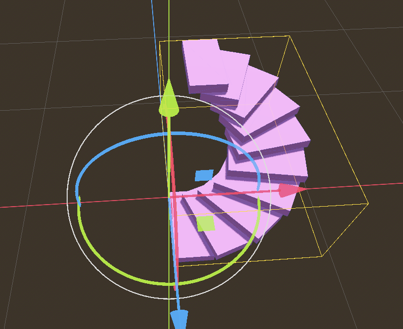

## Download links

Download a {download}`Godot Script <basics/player.gd>`.

Download a {download}`Godot Scene <basics/player.tscn>`.

Download a {download}`Godot Project <basics.zip>`.
