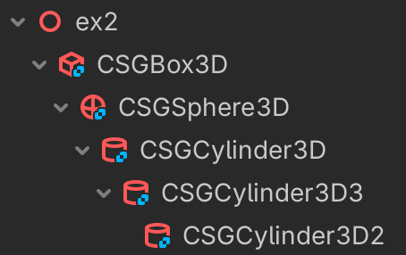

# Constructive Solid Geometry

## Exercice 1

Create the 3 shapes which are combined from red cube and blue sphere

## Exercice 2

Create this complex shapes which are combined from a 
- red cube 
- blue sphere
- 3 green cylinders

## Play the game

The game is hosted on GitHub Pages. You can play it here.

[link](https://rasql.github.io/godot/csg/index.html)

