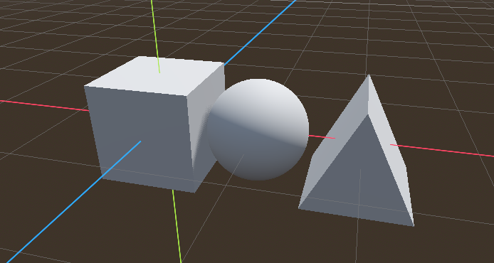

# MyST reference

[Source](https://myst-parser.readthedocs.io/en/latest/index.html)

## Heading 2

### Heading 3

#### Heading 4


## Style

- Use **two asterisks** or underscores for **bold**.
- Use *one asterisk* or underscore *italics*.
- Use backquotes for `code`

## Lists
Use `*`, `-`, or `+` for unordered lists. 
- apple
- banana

Use `1.` for ordered lists.

1. apple
1. banana

## Syntax

````
```{directivename} arguments
:key1: val1
:key2: val2

This is
directive content
```
````

## Admonitions

```{admonition} This is my admonition
This is my note.
```

```{caution} This is my admonition
This is my note.
```

```{danger} This is my admonition
This is my note.
```

```{error} This is my admonition
This is my note.
```

```{hint} This is my admonition
This is my note.
```

```{important} This is my admonition
This is my note.
```

```{note} Notes require **no** arguments, so content can start here.
```

```{tip}Notes require **no** arguments, so content can start here.
```

## Nesting directives

````{note}
The next info should be nested
```{warning}
Here's my warning:
```
````

## Code

```{code-block} python
:lineno-start: 10
:emphasize-lines: 1, 3

a = 2
print('my 1st line')
print(f'my {a}nd line')
```

### Literal include

[Reference](https://www.sphinx-doc.org/en/master/usage/restructuredtext/directives.html#directive-literalinclude)

```{literalinclude} 3_basics/basics/player.gd
:language: gd
:linenos:
```
### start-at

The `_ready` function:

```{literalinclude} ./3_basics/basics/player.gd
:language: gd
:linenos:
:start-at: func _ready
:end-before: func _process
```

The `_unhandled_input` function

```{literalinclude} 3_basics/basics/player.gd
:language: gd
:linenos:
:start-at: func _unhandled_input(event):
```

The `_process` function

```{literalinclude} 3_basics/basics/player.gd
:language: gd
:linenos:
:start-at: func _process
:end-before: func _unhandled_input
```

## Images

Include full resolution.



Image with 200px width.

{w=200px}

## Math

Since Pythagoras, we know that {math}` a^2 + b^2 = c^2`.

```{math}
:label: mymath
(a + b)^2 = a^2 + 2ab + b^2

(a + b)^2  &=  (a + b)(a + b) \\
           &=  a^2 + 2ab + b^2
```

The equation {eq}`mymath` is a quadratic equation.

## Download

Download a {download}`Godot Script <3_basics/basics/player.gd>`.

Download a {download}`Godot Scene <3_basics/basics/player.tscn>`.

Download a {download}`Godot Project <3_basics/basics.zip>`.

## Play the web game

[Play the project online](_static/intro/intro.html){.external}

Include the game with an iframe.

```
<iframe src="_static/intro/basics.html" width="100%" height="500px" 
style="border:none;" allow="cross-origin-isolated"></iframe>
```

<iframe src="_static/intro/basics.html" width="100%" height="500px" style="border:none;" allow="cross-origin-isolated"></iframe>