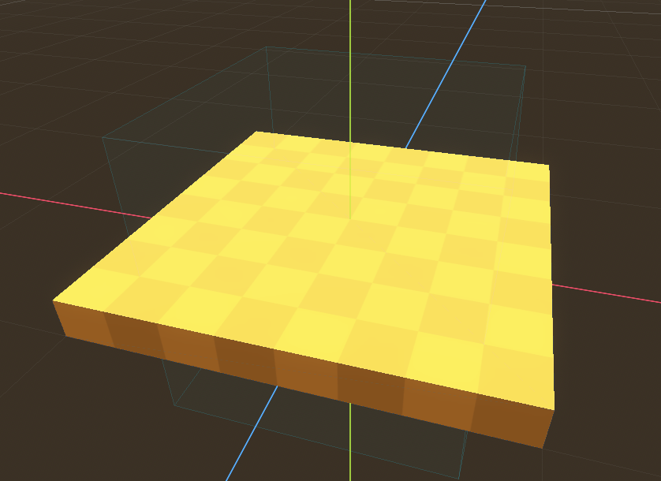

Usage
=====

.. _installation:

Installation
------------

To use Lumache, first install it using pip:

.. code-block:: console

   (.venv) $ pip install lumache

Creating recipes
----------------

To retrieve a list of random ingredients,
you can use the ``lumache.get_random_ingredients()`` function:

.. py:function:: lumache.get_random_ingredients(kind=None)

   Return a list of random ingredients as strings.

   :param kind: Optional "kind" of ingredients.
   :type kind: list[str] or None
   :return: The ingredients list.
   :rtype: list[str]

Images
------

To insert an image, you can use the ``.. image::`` directive:

.. image:: images/obj_tree.png

To insert an image, you can use the ``.. image::`` directive:

